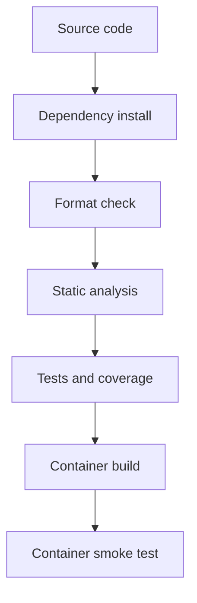

# Chapter 1 — Introduction to MLOps

[](https://github.com/moahmedzaghloula/practical-mlops-book/actions/workflows/ci.yml)

> **Status:** Complete
> **Primary outcome:** A reproducible Python project with local quality gates,
> multi-version CI, and a runnable container image.

[← Repository home](../../README.md) ·
[Hands-on lab](labs/python-ci-scaffold/) ·
[Study notes](notes/chapter-notes.md) ·
[Chapter 2 →](../02-mlops-foundations/)

## Overview

This chapter establishes the engineering contract used throughout the rest of
the repository. The example application is intentionally small so the focus
stays on the operational system around it: dependency isolation, deterministic
commands, automated checks, CI feedback, and container packaging.

The same contract later expands from ordinary Python code to datasets, training
jobs, model artifacts, inference APIs, deployment workflows, and monitoring.

## Learning Objectives

By the end of the chapter, the repository demonstrates how to:

- distinguish DevOps delivery concerns from the additional data and model
  lifecycle concerns introduced by MLOps;
- create an isolated Python environment on Fedora;
- declare direct dependencies and capture a resolved dependency snapshot;
- format source code consistently with Black;
- perform static analysis with Pylint;
- test behavior and report coverage with Pytest and pytest-cov;
- expose a single developer interface through GNU Make;
- test multiple supported Python versions with GitHub Actions; and
- package and execute the application as a container image.

## Delivery Flow



Every stage must pass before the change is considered releasable. This is the
first version of the quality-gate pattern reused in later chapters.

## Toolchain

| Tool | Responsibility |
|---|---|
| Python virtual environment | Isolate project packages from Fedora system Python |
| `pip` | Install declared dependencies |
| Black | Enforce deterministic formatting |
| Pylint | Detect code-quality and static-analysis issues |
| Pytest | Execute behavioral tests |
| pytest-cov | Measure executed source lines |
| GNU Make | Provide memorable, repeatable task entry points |
| GitHub Actions | Re-run the quality contract on clean hosted runners |
| Podman/Docker | Build and run the packaged application |

## Chapter Layout

```text
01-introduction-to-mlops/
├── README.md
├── notes/
│   └── chapter-notes.md
└── labs/
    └── python-ci-scaffold/
        ├── README.md
        ├── Dockerfile
        ├── Makefile
        ├── hello.py
        ├── requirements.txt
        ├── requirements.lock.txt
        └── test_hello.py
```

## Quick Start on Fedora

Install the host tools once:

```bash
sudo dnf install -y python3 python3-pip git make podman
```

Create an isolated environment and run the complete local pipeline:

```bash
cd ~/practical-mlops-book/chapters/01-introduction-to-mlops/labs/python-ci-scaffold
python3 -m venv .venv
source .venv/bin/activate
make all
```

Successful completion means:

- dependencies installed inside `.venv`;
- both Python files already match Black formatting;
- Pylint completes without an error;
- the unit test passes; and
- coverage is reported for `hello.py`.

## Make Targets

| Target | Command performed | Purpose |
|---|---|---|
| `make install` | Upgrade `pip` and install `requirements.txt` | Prepare the environment |
| `make format` | Rewrite source with Black | Apply formatting |
| `make format-check` | Run Black in check-only mode | CI-safe formatting gate |
| `make lint` | Run Pylint | Static-analysis gate |
| `make test` | Run Pytest with coverage | Behavioral gate |
| `make all` | Install, format-check, lint, and test | Complete local contract |

## Container Validation

Build from the lab directory:

```bash
cd ~/practical-mlops-book/chapters/01-introduction-to-mlops/labs/python-ci-scaffold
podman build --tag localhost/practical-mlops-ch01:1.0.0 .
```

Run the image as an ephemeral container:

```bash
podman run --rm localhost/practical-mlops-ch01:1.0.0
```

Expected application output:

```text
2
```

Inspect the resulting image:

```bash
podman image inspect localhost/practical-mlops-ch01:1.0.0
podman history localhost/practical-mlops-ch01:1.0.0
```

## Continuous Integration

The workflow in [`.github/workflows/ci.yml`](../../.github/workflows/ci.yml)
contains two independent jobs:

1. A Python matrix runs the same Make targets on Python 3.11, 3.12, and 3.13.
2. A container job builds the Dockerfile and smoke-tests the resulting image.

The matrix answers a compatibility question that a single local interpreter
cannot answer: does the project contract still hold across every Python version
the repository claims to support?

## Quality and Reproducibility Notes

- `requirements.txt` declares the small direct toolset used by the lab.
- `requirements.lock.txt` records the exact resolved environment used during
  the study session.
- `.venv`, caches, bytecode, and coverage databases stay outside Git.
- Local development and CI call the same Make targets to reduce configuration
  drift.
- The test asserts behavior; a successful container build alone does not prove
  the application is correct.

## Troubleshooting

### `No module named pytest` or `No module named pylint`

The active virtual environment does not contain the project dependencies:

```bash
source .venv/bin/activate
make install
```

### Black reports that a file would be reformatted

Apply formatting, then re-run the full gate:

```bash
make format
make all
```

### The wrong Python interpreter is being used

```bash
which python
python --version
python -m pip --version
```

All three paths should refer to the lab's `.venv` while it is active.

## DevOps, MLOps, and LLMOps Connection

| Layer | What this chapter establishes | Later extension |
|---|---|---|
| DevOps | Code checks, tests, CI, and build artifacts | Automated deployment and observability |
| MLOps | Reproducible execution contract | Data validation, model lineage, and serving checks |
| LLMOps | Reliable Python delivery baseline | Prompt/evaluation versioning and model-serving gates |

## Completion Criteria

- [x] Isolated Fedora development environment
- [x] Formatting and static-analysis automation
- [x] Unit test and coverage report
- [x] Reusable Make targets
- [x] Python-version matrix CI
- [x] Container build and smoke test
- [x] Chapter and lab documentation

## Key Takeaways

- Reproducibility begins before model training; it begins with the project
  environment and its commands.
- Local and CI workflows should share the same entry points.
- A build artifact is useful only when behavior has already been validated.
- MLOps does not replace DevOps; it extends it with data and model concerns.

[← Repository home](../../README.md) ·
[Open the lab](labs/python-ci-scaffold/) ·
[Continue to Chapter 2 →](../02-mlops-foundations/)
