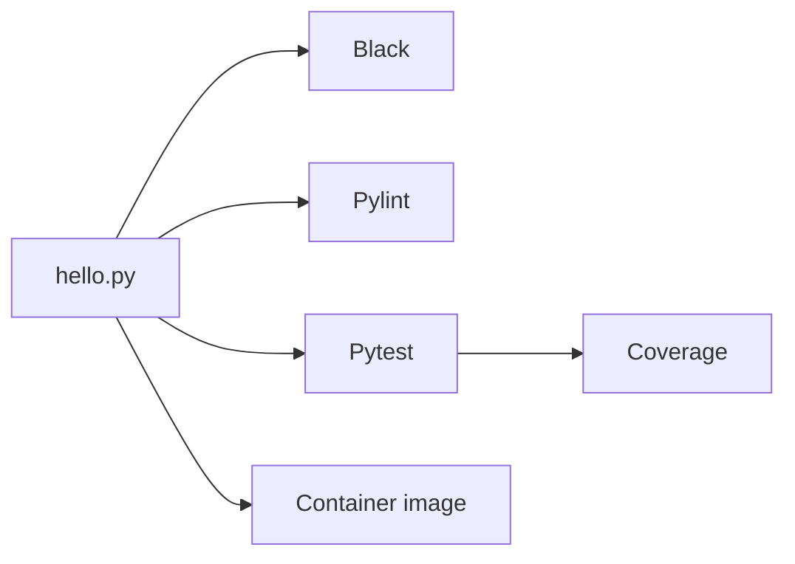

# Python CI Scaffold

> **Chapter:** [01 — Introduction to MLOps](../../README.md)
> **Status:** Complete
> **Purpose:** Demonstrate the smallest useful Python delivery pipeline from
> source code to tests, CI, and a runnable container.

[← Chapter overview](../../README.md) · [Repository home](../../../../README.md)

## What This Lab Proves

The application contains only one function, but the surrounding workflow
proves several production-relevant properties:

- a new developer can recreate the environment;
- code style is enforced automatically;
- static analysis is repeatable;
- behavior is protected by a test;
- coverage is visible;
- the same tasks run locally and in CI; and
- the application can be packaged and executed as a container.

## Execution Model



## Project Files

| File | Responsibility |
|---|---|
| `hello.py` | Defines `add(x, y)` and the command-line entry point |
| `test_hello.py` | Verifies the addition behavior |
| `requirements.txt` | Declares direct development dependencies |
| `requirements.lock.txt` | Captures resolved package versions |
| `Makefile` | Exposes the local quality-gate commands |
| `Dockerfile` | Packages the runnable script |
| `README.md` | Documents setup, validation, and failure recovery |

## Prerequisites

```bash
sudo dnf install -y python3 python3-pip make podman
```

Verify the tools:

```bash
python3 --version
git --version
make --version
podman version
```

## Environment Setup

```bash
cd ~/practical-mlops-book/chapters/01-introduction-to-mlops/labs/python-ci-scaffold
python3 -m venv .venv
source .venv/bin/activate
python -m pip install --upgrade pip
python -m pip install -r requirements.txt
```

Verify that commands resolve inside the virtual environment:

```bash
which python
python -m pip --version
python -m pytest --version
python -m pylint --version
```

## Run the Application

```bash
python hello.py
```

Expected output:

```text
2
```

## Run the Complete Quality Pipeline

```bash
make all
```

The dependency chain is:

```text
install → format-check → lint → test + coverage
```

Run a single gate when diagnosing a failure:

```bash
make format-check
make lint
make test
```

Apply formatting changes:

```bash
make format
```

## Test Contract

The test imports the function instead of executing the script as a subprocess:

```python
from hello import add


def test_add():
    assert 2 == add(1, 1)
```

Importing is safe because the command-line behavior is protected by:

```python
if __name__ == "__main__":
```

This separation becomes more important in training modules and inference APIs,
where import-time side effects can be slow, expensive, or unsafe.

## Coverage Interpretation

```bash
python -m pytest \
  -vv \
  --cov=hello \
  --cov-report=term-missing \
  test_hello.py
```

Coverage identifies source lines that the test did not execute. It is a signal,
not proof of correctness: high coverage can still coexist with weak assertions.

## Container Workflow

Build the image:

```bash
podman build --tag localhost/practical-mlops-ch01:1.0.0 .
```

Run it and remove the stopped container automatically:

```bash
podman run --rm localhost/practical-mlops-ch01:1.0.0
```

Validate the output and exit status in one command:

```bash
test "$(podman run --rm localhost/practical-mlops-ch01:1.0.0)" = "2" \
  && echo "Lab 01 container smoke test passed"
```

Inspect the image configuration:

```bash
podman image inspect localhost/practical-mlops-ch01:1.0.0
```

## CI Contract

The repository workflow runs the Python checks on 3.11, 3.12, and 3.13 and
performs an independent container build. A local pass is necessary but CI is
the clean-environment confirmation.

## Common Failures

| Symptom | Cause | Recovery |
|---|---|---|
| `No module named pytest` | Dependencies were not installed in the active interpreter | Activate `.venv` and run `make install` |
| Black says a file would be reformatted | Source differs from the formatter contract | Run `make format`, then `make all` |
| Pylint fails | Static-analysis issue in source or test | Read the message ID and fix the reported line |
| Coverage is below expectation | A branch or statement is untested | Add a meaningful assertion, not a cosmetic test |
| Podman cannot find the image | Build failed or a different tag was used | Run `podman images` and rebuild with the documented tag |

## Cleanup

Deactivate the Python environment:

```bash
deactivate
```

Remove only this lab's local image when it is no longer needed:

```bash
podman image rm localhost/practical-mlops-ch01:1.0.0
```

The `.venv`, caches, and coverage files are intentionally ignored by Git.

## Production Lessons

- Keep automation entry points small and composable.
- Run tools through `python -m` so they use the active interpreter.
- Separate importable logic from command-line side effects.
- Treat formatting, linting, and tests as independent failure signals.
- Validate the packaged artifact, not only the source tree.

[← Chapter overview](../../README.md) · [Repository home](../../../../README.md)
