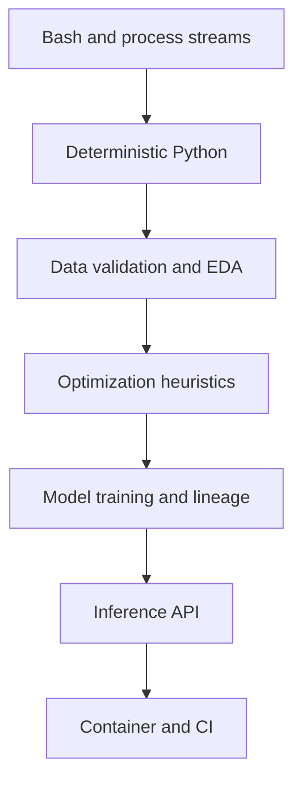

# Chapter 2 — MLOps Foundations

[](https://github.com/moahmedzaghloula/practical-mlops-book/actions/workflows/chapter-02.yml)

> **Status:** Complete
> **Primary outcome:** Progress from shell automation and Python scripting to a
> validated dataset, optimization experiments, a trained model artifact, and a
> tested containerized inference API.

[← Chapter 1](../01-introduction-to-mlops/) ·
[Repository home](../../README.md) ·
[Chapter 3 →](../03-containers-and-edge-devices/)

## Overview

Chapter 2 builds the technical foundations required to turn exploratory ML work
into an engineering system. Each lab adds one layer of operational discipline:
shell composition, deterministic Python, data contracts, algorithm evaluation,
artifact lineage, API contracts, containerization, and CI.

The chapter deliberately separates these concerns instead of hiding them inside
one notebook. That separation makes failures diagnosable and makes individual
steps reusable in local development, CI/CD, and future workflow orchestrators.

## Learning Path



## Lab Status

| Lab | Focus | Core deliverable | Status |
|---:|---|---|---|
| [01](labs/01-bash-foundations/) | Bash foundations | Stream, pipeline, sampling, and exit-code exercises | Complete |
| [02](labs/02-python-foundations/) | Python foundations | Deterministic executable Python script | Complete |
| [03](labs/03-eda/) | Reproducible EDA | Data contract, processed datasets, tests, and figures | Complete |
| [04](labs/04-optimization/) | Optimization and TSP | Tested heuristics plus API-backed coordinate exercise | Complete |
| [05](labs/05-flask-ml-api/) | ML model API | Model artifact, metadata, Flask API, container, and CI | Complete |

## Skills Demonstrated

### Automation

- standard input, standard output, and standard error;
- pipelines and redirection;
- meaningful process exit behavior; and
- Make targets as reproducible task interfaces.

### Data and Modeling

- schema, missing-value, range, and uniqueness checks;
- immutable raw inputs and reproducible processed outputs;
- descriptive statistics, correlation, regression, KDE, and distributions;
- deterministic random seeds;
- greedy and nearest-neighbor heuristics; and
- train/test splitting, evaluation metrics, and model serialization.

### Production Delivery

- artifact metadata and dataset fingerprints;
- liveness and readiness endpoints;
- input schema and range validation;
- contract-focused API tests;
- Gunicorn serving;
- non-root container execution; and
- path-scoped GitHub Actions.

## Repository Layout

```text
02-mlops-foundations/
├── README.md
└── labs/
    ├── 01-bash-foundations/
    │   └── README.md
    ├── 02-python-foundations/
    │   ├── README.md
    │   └── add.py
    ├── 03-eda/
    │   ├── README.md
    │   ├── Makefile
    │   ├── data/
    │   ├── figures/
    │   ├── src/
    │   └── tests/
    ├── 04-optimization/
    │   ├── README.md
    │   ├── Makefile
    │   ├── coin_change.py
    │   ├── tsp.py
    │   ├── restaurant_tsp.py
    │   └── tests/
    └── 05-flask-ml-api/
        ├── README.md
        ├── Makefile
        ├── app.py
        ├── train.py
        ├── tests/
        └── Dockerfile
```

## Fedora Prerequisites

```bash
sudo dnf install -y \
  python3 \
  python3-pip \
  git \
  make \
  podman \
  curl \
  jq
```

Each Python lab owns its virtual environment. Do not reuse Chapter 1's `.venv`
or install project packages into Fedora's system interpreter.

## Recommended Execution Order

Run the labs in numerical order. The first two are intentionally small and do
not require a virtual environment with external packages. Labs 03–05 contain
their own setup and validation runbooks.

```bash
cd ~/practical-mlops-book/chapters/02-mlops-foundations/labs/01-bash-foundations
```

Then continue through the linked lab documentation:

1. [Bash Foundations](labs/01-bash-foundations/)
2. [Python Foundations](labs/02-python-foundations/)
3. [Reproducible EDA](labs/03-eda/)
4. [Optimization and TSP](labs/04-optimization/)
5. [Flask ML API](labs/05-flask-ml-api/)

## Generated Evidence

| Evidence | Produced by | Why it matters |
|---|---|---|
| Captured stdout/stderr | Lab 01 | Makes process behavior inspectable |
| Deterministic CLI output | Lab 02 | Proves repeatable random behavior |
| Cleaned CSVs and statistics | Lab 03 | Converts exploration into traceable artifacts |
| Visualization PNGs | Lab 03 | Communicates distributions and relationships |
| Unit tests and coverage | Labs 03–05 | Protects code and API behavior |
| Coordinate cache | Lab 04 | Separates live API acquisition from offline calculation |
| Model and metadata | Lab 05 | Couples a deployable model with lineage information |
| Container image | Lab 05 | Packages application runtime and model artifact |

## EDA Figures

### Regression relationship


### Marginal distributions


### Joint density


## Continuous Integration

[`chapter-02.yml`](../../.github/workflows/chapter-02.yml) is path-scoped to
this chapter. It currently validates the two most production-oriented labs:

- the optimization lab runs formatting, Ruff, tests, coverage, and deterministic
  command-line examples; and
- the Flask lab runs formatting, Ruff, model training, API tests, coverage, and
  a container build.

The live Nominatim exercise is intentionally excluded from CI because a public
third-party API should not determine whether an offline code change passes.

## Artifact and Data Policy

- Raw external data is treated as an immutable input.
- Processing writes new files instead of silently modifying raw data.
- Network-derived coordinates are cached for repeatability and responsible API
  use.
- Training records a dataset hash, model version, metrics, and UTC timestamp.
- Generated artifacts are never trusted solely because they exist; tests and
  validation define their acceptance criteria.
- Secrets, virtual environments, caches, and local credentials stay outside Git.

## DevOps-to-MLOps Mapping

| DevOps concept | MLOps extension demonstrated here |
|---|---|
| Shell pipeline | Multi-stage data and model workflow |
| Configuration validation | Dataset contract validation |
| Build checksum | Dataset fingerprint |
| Release artifact | Serialized model plus metadata |
| Unit/API test | Training, inference, and schema test |
| Liveness probe | `/health` endpoint |
| Readiness probe | Model-aware `/ready` endpoint |
| Service image | Model-serving container |
| CI pipeline | Code, model, API, and image quality gates |

## LLMOps Connection

These foundations transfer directly to LLM systems:

- dataset validation becomes prompt, evaluation, and conversation-set
  validation;
- model metadata expands to base model, adapter, tokenizer, and quantization
  lineage;
- API contracts include token limits, generation parameters, and streaming;
- readiness includes model weights, GPU memory, and dependent retrieval systems;
- evaluation adds quality, safety, latency, throughput, and cost gates.

## Completion Criteria

- [x] Bash stream and pipeline exercises
- [x] Deterministic executable Python example
- [x] Validated and reproducible EDA pipeline
- [x] Tested optimization algorithms
- [x] Cached live-coordinate exercise
- [x] Trained model artifact with metadata
- [x] Validated inference API
- [x] Non-root container image
- [x] Chapter CI workflow
- [x] Professional chapter and lab documentation

## Key Takeaways

- Exploratory success is not production readiness.
- Validation must happen before downstream computation.
- Determinism and artifact lineage make failures reproducible.
- Training and serving are separate lifecycle stages.
- ML delivery needs code, data, model, API, and runtime evidence.

[← Chapter 1](../01-introduction-to-mlops/) ·
[Repository home](../../README.md) ·
[Continue to Chapter 3 →](../03-containers-and-edge-devices/)
