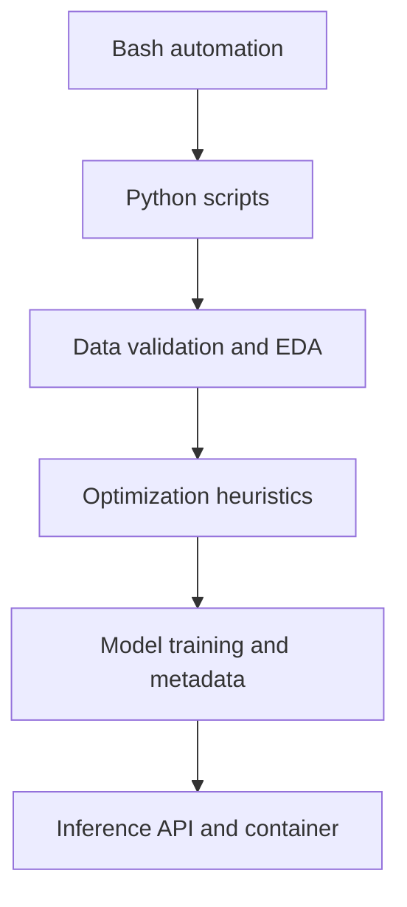
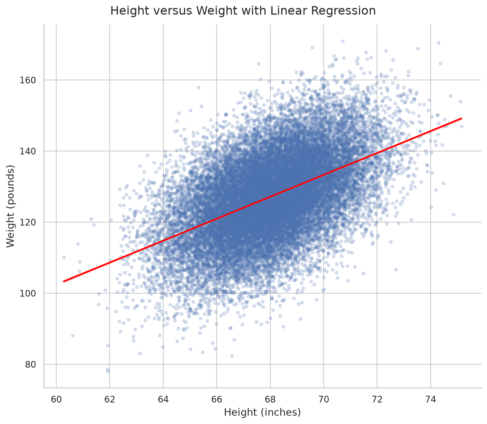
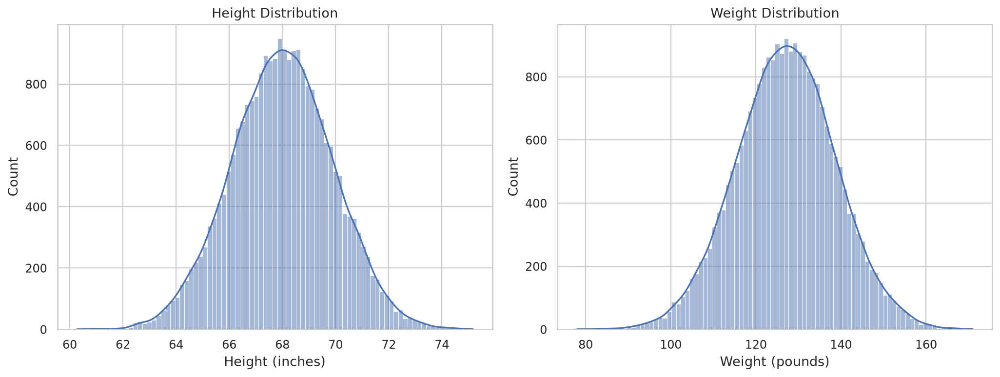
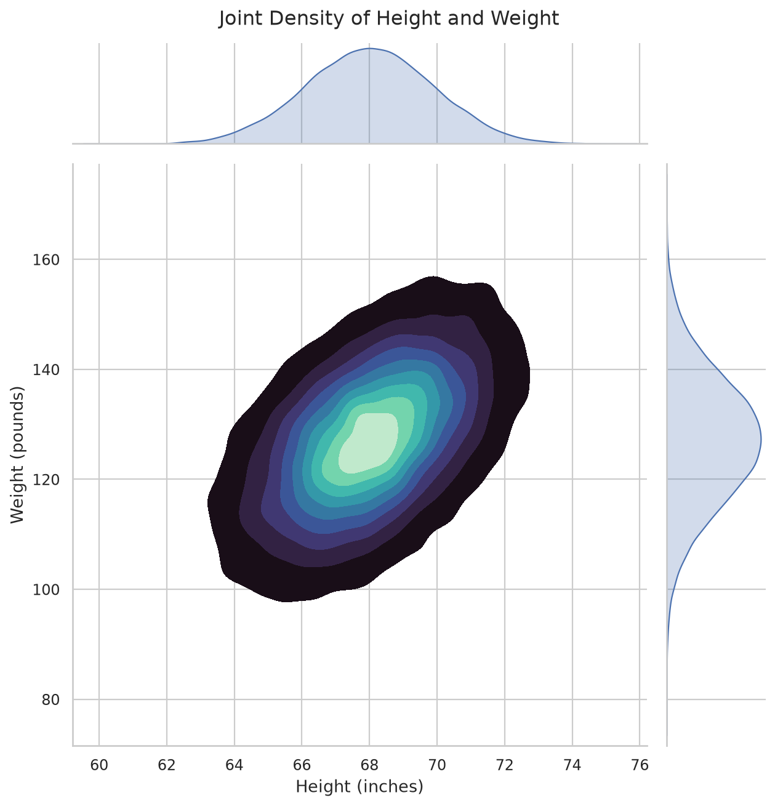

# Chapter 2 — MLOps Foundations

Chapter 2 develops the foundations needed to move from exploratory machine
learning work to repeatable, testable, and deployable ML systems.

## Chapter Status

| Lab | Topic | Status |
|---:|---|---|
| 01 | Bash foundations | Complete |
| 02 | Python foundations | Complete |
| 03 | Exploratory data analysis | Complete |
| 04 | Optimization and TSP | Complete |
| 05 | Flask ML API | In progress |

## Learning Path



## Chapter Structure

```text
02-mlops-foundations/
├── README.md
└── labs/
    ├── 01-bash-foundations/
    ├── 02-python-foundations/
    ├── 03-eda/
    ├── 04-optimization/
    └── 05-flask-ml-api/
```

## Labs

| Lab | Outcome |
|---|---|
| [01 — Bash](labs/01-bash-foundations/) | Pipelines, redirection, sampling, and stream handling |
| [02 — Python](labs/02-python-foundations/) | Executable scripts, functions, iteration, and entry points |
| [03 — EDA](labs/03-eda/) | Validation, statistics, cleaned data, plots, and tests |
| [04 — Optimization](labs/04-optimization/) | Greedy change, TSP, random restarts, geocoding, and caching |
| [05 — ML API](labs/05-flask-ml-api/) | Training, metadata, Flask inference, tests, CI, and containers |

## EDA Visualizations







## Reproducible Workflow

```bash
cd chapters/02-mlops-foundations/labs/LAB_DIRECTORY
python3 -m venv .venv
source .venv/bin/activate
make install
make all
```

## Chapter CI

[`chapter-02.yml`](../../.github/workflows/chapter-02.yml) validates the
optimization and Flask API labs. It runs formatting checks, linting, tests,
coverage, runnable examples, and a container build.

## DevOps Connection

| Chapter concept | DevOps equivalent or extension |
|---|---|
| Data validation | Configuration and policy validation |
| Dataset hash | Artifact checksum and traceability |
| Model metadata | Release metadata |
| Reproducible seed | Deterministic build input |
| Model artifact | Versioned build artifact |
| `/health` | Liveness check |
| `/ready` | Readiness check |
| Inference tests | API contract tests |

## LLMOps Connection

The same patterns later apply to prompt and evaluation datasets, token-length
distributions, embedding indexes, retrieval evaluation, inference readiness,
and latency, quality, safety, and cost monitoring.

## Critical Takeaways

- Successful exploration is not automatically reproducible production code.
- Data contracts must be validated before training and inference.
- A heuristic may be useful without being globally optimal.
- Training, artifacts, serving, and monitoring are separate lifecycle stages.
- ML CI must eventually validate code, data, models, and serving behavior.
