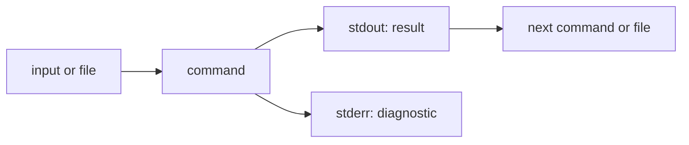

# Lab 01 — Bash Foundations for MLOps

> **Chapter:** [02 — MLOps Foundations](../../README.md)
> **Status:** Complete
> **Focus:** Standard streams, redirection, pipelines, deterministic fixtures,
> sampling, exit codes, and shell-level validation.

[← Chapter overview](../../README.md) ·
[Next lab: Python Foundations →](../02-python-foundations/) ·
[Repository home](../../../../README.md)

## Why This Lab Exists

ML pipelines are usually collections of programs rather than one large process.
Data acquisition, validation, training, evaluation, packaging, and deployment
must exchange data and report failure reliably. Bash is often the first layer
connecting those steps locally, in CI, or inside a container entry point.

This lab isolates the stream and process behaviors that later Makefiles and CI
workflows depend on.

## Learning Objectives

- create small deterministic input fixtures;
- distinguish `stdin`, `stdout`, and `stderr`;
- redirect output and errors independently;
- connect commands with a pipeline;
- understand the exit status of a failing command;
- produce bounded random samples; and
- verify outputs with shell assertions.

## Stream Model

| Descriptor | Stream | Default destination |
|---:|---|---|
| `0` | standard input (`stdin`) | Keyboard or previous pipeline command |
| `1` | standard output (`stdout`) | Terminal |
| `2` | standard error (`stderr`) | Terminal |



## Files

| File | Role |
|---|---|
| `input.txt` | Three-line deterministic fixture |
| `numbers.txt` | Integer population from 1 through 1000 |
| `sample.txt` | Ten-line random sample |
| `stdout.log` | Captured successful `ls` output |
| `stderr.log` | Captured missing-file diagnostic |

## Prerequisites

The required commands are provided by Fedora's standard userland. Verify them:

```bash
command -v bash
command -v printf
command -v wc
command -v seq
command -v shuf
```

## Exercise 1 — Create and Count a Fixture

```bash
cd ~/practical-mlops-book/chapters/02-mlops-foundations/labs/01-bash-foundations
printf '%s\n' alpha beta gamma > input.txt
cat input.txt
wc -l input.txt
```

Expected count:

```text
3 input.txt
```

Run the equivalent pipeline:

```bash
cat input.txt | wc -l
```

Expected output:

```text
3
```

`wc -l input.txt` can open the file directly and is the simpler production
choice. The pipeline is retained to demonstrate how one program's `stdout`
becomes another program's `stdin`.

## Exercise 2 — Generate and Sample Records

```bash
seq 1 1000 > numbers.txt
shuf -n 10 numbers.txt > sample.txt
wc -l sample.txt
```

Expected result:

```text
10 sample.txt
```

`shuf` is intentionally nondeterministic here. A production ML experiment that
depends on reproducible sampling should use a tool or script with an explicit
seed and record that seed in metadata.

## Exercise 3 — Separate Output and Errors

```bash
ls input.txt missing.txt > stdout.log 2> stderr.log
```

The command is expected to return a non-zero exit code because one path does
not exist. Inspect it immediately:

```bash
echo $?
```

Then inspect the two streams:

```bash
cat stdout.log
cat stderr.log
```

Expected behavior:

- `stdout.log` contains `input.txt`;
- `stderr.log` contains the missing-file diagnostic; and
- the `ls` process reports failure even though one requested file exists.

## Validation

Run the following from this directory:

```bash
test "$(wc -l < input.txt)" -eq 3 \
  && test "$(wc -l < numbers.txt)" -eq 1000 \
  && test "$(wc -l < sample.txt)" -eq 10 \
  && grep -qx 'input.txt' stdout.log \
  && grep -q 'missing.txt' stderr.log \
  && echo "Lab 01 validation passed"
```

This command validates content and counts instead of trusting file existence
alone.

## Exit-Code Discipline

Shell automation should normally stop when an essential command fails. In a
larger script, a common baseline is:

```bash
set -euo pipefail
```

| Option | Effect |
|---|---|
| `-e` | Exit when an unhandled command fails |
| `-u` | Treat an unset variable as an error |
| `-o pipefail` | Fail a pipeline when any stage fails |

These options are useful but not magic; expected failures still need explicit
handling and clear diagnostics.

## Common Failures

| Symptom | Explanation | Fix |
|---|---|---|
| `wc` reports a missing file | The command is running from the wrong directory | Run `pwd`, then `cd` to the lab |
| `stderr.log` is empty | The missing path exists or stderr was not redirected | Remove ambiguity and repeat the documented `ls` command |
| `sample.txt` changes | `shuf` is random by design | Validate its size and range, not exact order |
| A failing pipeline appears successful | The last command returned zero | Use `set -o pipefail` in automation scripts |

## MLOps and LLMOps Connection

- Dataset download tools should write data to `stdout` or a named artifact and
  diagnostics to `stderr`.
- Training commands must return non-zero when model acceptance criteria fail.
- CI uses exit codes to decide whether a model or image may advance.
- LLM evaluation pipelines often compose dataset preparation, inference,
  scoring, and report generation through the same process model.

## Completion Evidence

- [x] Three-row deterministic input fixture
- [x] One-thousand-row numeric population
- [x] Ten-row sample
- [x] Independently captured stdout and stderr
- [x] Non-zero failure behavior observed
- [x] Shell assertions pass

[← Chapter overview](../../README.md) ·
[Next lab: Python Foundations →](../02-python-foundations/)
