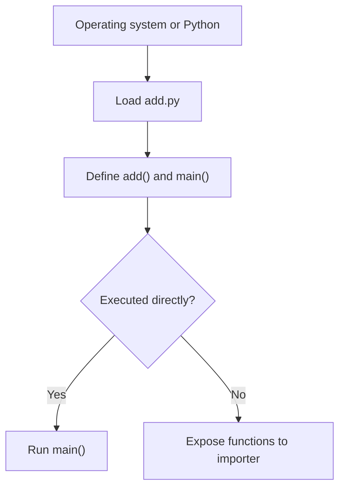

# Lab 02 — Python Foundations

> **Chapter:** [02 — MLOps Foundations](../../README.md)
> **Status:** Complete
> **Focus:** Executable scripts, typed functions, deterministic randomness,
> loops, entry points, and basic validation without external packages.

[← Previous lab: Bash Foundations](../01-bash-foundations/) ·
[Chapter overview](../../README.md) ·
[Next lab: Reproducible EDA →](../03-eda/)

## Why This Lab Exists

Training jobs, batch inference tasks, data validators, and API startup commands
all begin as executable Python programs. This lab uses a deliberately small
addition example to establish predictable script structure before adding data
libraries and ML frameworks.

## Learning Objectives

- understand a Unix shebang;
- manage executable permissions;
- separate reusable functions from command-line behavior;
- use type annotations and docstrings;
- use a local random-number generator with an explicit seed; and
- validate syntax without executing application behavior.

## Program Structure



## File Layout

```text
02-python-foundations/
├── README.md
└── add.py
```

## Source Responsibilities

| Element | Purpose |
|---|---|
| `#!/usr/bin/env python3` | Locate Python 3 through the current `PATH` |
| `add(x, y)` | Small reusable, typed function |
| `Random(42)` | Local deterministic pseudo-random generator |
| `main()` | Own command-line execution behavior |
| `if __name__ == "__main__"` | Prevent `main()` from running during import |

## Prerequisites

```bash
sudo dnf install -y python3
python3 --version
```

No third-party dependencies or virtual environment are required for this lab.

## Run Through the Interpreter

```bash
cd ~/practical-mlops-book/chapters/02-mlops-foundations/labs/02-python-foundations
python3 add.py
```

The script prints ten deterministic addition examples. Running it again should
produce the same sequence because the generator uses seed `42`.

## Run as an Executable

Grant the owner, group, and others the executable bit without changing read or
write permissions:

```bash
chmod +x add.py
```

Verify the permission bits:

```bash
ls -l add.py
```

Execute through the shebang:

```bash
./add.py
```

## Validate Syntax

```bash
python3 -m py_compile add.py
```

Exit code `0` means Python parsed and compiled the module successfully:

```bash
echo $?
```

Syntax validation does not prove business correctness, so directly verify the
reusable function as well:

```bash
python3 -c 'from add import add; assert add(20, 22) == 42; print("Function validation passed")'
```

## Validate Determinism

Compare two independent executions without keeping permanent output files:

```bash
diff \
  <(python3 add.py) \
  <(python3 add.py) \
  && echo "Deterministic output confirmed"
```

`<(...)` is Bash process substitution. Each command is exposed to `diff` like a
temporary readable stream.

## Why Use `Random(42)` Instead of Global State?

```python
random_generator = Random(42)
```

The object owns its state locally. Importing another module that uses Python's
global random generator cannot silently change this script's sequence. The same
idea matters in ML experiments: isolate and record random state wherever the
framework allows it.

## Common Failures

| Symptom | Cause | Fix |
|---|---|---|
| `./add.py: Permission denied` | Executable bit is missing | Run `chmod +x add.py` |
| `./add.py: No such file or directory` | Wrong directory or incorrect filename | Check `pwd` and `ls -la` |
| `/usr/bin/env: python3: No such file` | Python 3 is absent from `PATH` | Install `python3` with DNF and inspect `command -v python3` |
| Output changes between runs | Seed or generator usage was modified | Restore the explicit local seed and re-run the determinism check |

## Production Connection

- `main()` creates a clean boundary for CLI behavior.
- Import-safe modules are easier to test and reuse.
- Type annotations improve editor feedback and static analysis.
- Deterministic pseudo-randomness makes failures reproducible.
- Executable scripts can become container entry points or scheduled jobs.

## Completion Evidence

- [x] Script runs through `python3`
- [x] Script runs directly through its shebang
- [x] Syntax compilation succeeds
- [x] Reusable function assertion succeeds
- [x] Repeated executions are deterministic

[← Previous lab: Bash Foundations](../01-bash-foundations/) ·
[Next lab: Reproducible EDA →](../03-eda/)
