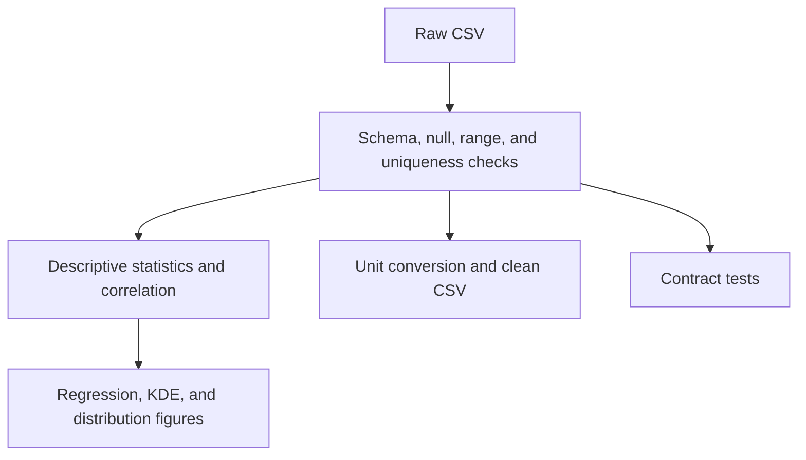

# Lab 03 — Reproducible Exploratory Data Analysis

> **Chapter:** [02 — MLOps Foundations](../../README.md)
> **Status:** Complete
> **Focus:** Dataset contracts, immutable raw inputs, reproducible processing,
> statistical summaries, automated plots, tests, and artifact evidence.

[← Previous lab: Python Foundations](../02-python-foundations/) ·
[Chapter overview](../../README.md) ·
[Next lab: Optimization and TSP →](../04-optimization/)

## Overview

This lab converts exploratory data analysis from an interactive, one-off action
into a repeatable pipeline. A height-and-weight CSV is validated before any
statistics or figures are generated. Accepted data is enriched with metric-unit
columns and written to a separate processed-data directory.

The important deliverable is not a pretty chart by itself. It is a documented
chain from a known raw input through validation and transformation to testable
outputs.

## Pipeline Architecture



## Learning Objectives

- define a dataset contract before analysis;
- reject missing, empty, malformed, duplicated, or out-of-range data;
- preserve the raw dataset and write derived data separately;
- calculate reproducible summary statistics and correlations;
- generate plots without requiring a desktop display;
- test both accepted and rejected data; and
- record an input checksum for lineage.

## Project Layout

```text
03-eda/
├── README.md
├── Makefile
├── requirements.txt
├── requirements.lock.txt
├── data/
│   ├── raw/
│   │   └── height-weight-25k.csv
│   └── processed/
│       ├── correlation-matrix.csv
│       ├── descriptive-statistics.csv
│       └── height-weight-clean.csv
├── figures/
│   ├── height-weight-distributions.png
│   ├── height-weight-kde.png
│   └── height-weight-regression.png
├── src/
│   ├── eda.py
│   └── validate_data.py
└── tests/
    └── test_validate_data.py
```

## Data Contract

The validator requires:

| Rule | Contract |
|---|---|
| File | Exists and is readable as CSV |
| Rows | Dataset is not empty |
| Columns | `Index`, `Height-Inches`, and `Weight-Pounds` exist |
| Nulls | Required columns contain no missing values |
| Height | Every value is between 40 and 100 inches |
| Weight | Every value is between 40 and 500 pounds |
| Identifier | `Index` values are unique |

Broad ranges detect obvious corruption; they are not a scientific definition of
all valid human measurements.

## Fedora Setup

```bash
cd ~/practical-mlops-book/chapters/02-mlops-foundations/labs/03-eda
python3 -m venv .venv
source .venv/bin/activate
python -m pip install --upgrade pip
python -m pip install -r requirements.txt
```

The main libraries are Pandas, NumPy, Matplotlib, Seaborn, Pytest, and
pytest-cov. JupyterLab is available for exploration, but the reproducible path
is the source scripts and Makefile.

## Acquire or Restore the Dataset

The repository study snapshot contains the CSV. If it is missing or needs to be
recreated from the original public source:

```bash
mkdir -p data/raw
curl \
  --fail \
  --location \
  --show-error \
  --output data/raw/height-weight-25k.csv \
  https://raw.githubusercontent.com/noahgift/regression-concepts/master/height-weight-25k.csv
```

Verify the exact snapshot used by this repository:

```bash
sha256sum data/raw/height-weight-25k.csv
```

Expected checksum:

```text
e179bd537471d395f39940aa879fca481846daac618269fcd6e3d91226921fdc
```

If the upstream source changes, do not silently replace the expected checksum.
Review the data difference and record a deliberate dataset version change.

## Run the Workflow

```bash
make all
```

The dependency order is:

```text
validate → analyze
         ↘ tests
```

Run stages separately while diagnosing:

```bash
make validate
make analyze
make test
```

Launch JupyterLab only for optional exploration:

```bash
make notebook
```

Any useful exploratory result should eventually be promoted into a script,
test, or documented artifact so it can be reproduced outside the notebook.

## Output Artifacts

| Artifact | Description |
|---|---|
| `descriptive-statistics.csv` | Count, mean, standard deviation, quartiles, minimum, and maximum |
| `correlation-matrix.csv` | Pearson correlation for height and weight |
| `height-weight-clean.csv` | Validated rows plus centimeter and kilogram columns |
| `height-weight-regression.png` | Scatter plot with fitted linear trend |
| `height-weight-kde.png` | Joint kernel-density estimate |
| `height-weight-distributions.png` | Marginal histograms and KDE curves |

## Visual Results

### Regression


### Distributions


### Joint density


## Headless Plotting

`matplotlib.use("Agg")` selects a non-interactive rendering backend before
importing `pyplot`. This prevents CI and remote servers from failing because no
graphical display is available.

## Tests and Coverage

```bash
python -m pytest \
  -vv \
  --cov=src \
  --cov-report=term-missing \
  tests
```

The tests exercise valid inputs and contract violations. Testing rejected data
is essential: a validator that only passes good data has not proved it can stop
bad data from reaching training.

## One-Command Validation

```bash
make all \
  && test -s data/processed/height-weight-clean.csv \
  && test -s data/processed/descriptive-statistics.csv \
  && test -s data/processed/correlation-matrix.csv \
  && test -s figures/height-weight-regression.png \
  && test -s figures/height-weight-kde.png \
  && test -s figures/height-weight-distributions.png \
  && echo "Lab 03 validation passed"
```

## Common Failures

| Symptom | Cause | Recovery |
|---|---|---|
| Dataset does not exist | Raw CSV is absent or the command ran from another directory | Restore the CSV and verify `pwd` |
| Missing-column error | Input schema changed | Inspect the header; update code only after a deliberate contract decision |
| Range validation fails | Corrupt data, unit mismatch, or changed population | Inspect rejected rows; do not merely widen limits |
| Plotting fails in CI | Interactive backend was selected | Ensure `Agg` is configured before importing `pyplot` |
| Import error for `validate_data` | Script was started from an unexpected path or layout changed | Use the documented Make target from the lab root |

## Production Lessons

- Validate data before analysis and training.
- Keep raw and processed zones distinct.
- Hash external inputs to make lineage inspectable.
- Treat plots and CSV reports as generated artifacts, not hand-edited source.
- Make headless execution a first-class requirement.
- Test invalid data paths as carefully as successful ones.

## LLMOps Connection

The same structure applies to prompt and evaluation datasets: validate schema,
roles, token length, duplication, labels, safety fields, and provenance before
using the records to fine-tune or evaluate a language model.

## Completion Evidence

- [x] Raw-data checksum recorded
- [x] Contract validation succeeds
- [x] Invalid-data tests pass
- [x] Processed datasets generated
- [x] Three analysis figures generated
- [x] Headless workflow succeeds

[← Previous lab: Python Foundations](../02-python-foundations/) ·
[Next lab: Optimization and TSP →](../04-optimization/)
