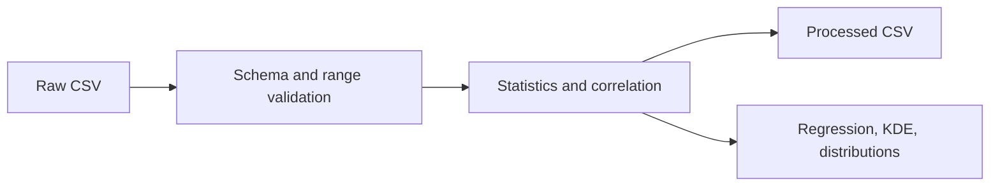

# Lab 03 — Reproducible Exploratory Data Analysis

This lab turns exploratory analysis into a validated, repeatable pipeline. It
uses a height-and-weight dataset to generate statistics, cleaned data, and
visualizations.

## Pipeline



## Setup

```bash
cd chapters/02-mlops-foundations/labs/03-eda
python3 -m venv .venv
source .venv/bin/activate
make install
```

## Download the Dataset

Raw data is intentionally not versioned in Git. Download the public dataset
before running validation:

```bash
mkdir -p data/raw
curl \
  --fail \
  --location \
  --show-error \
  --output data/raw/height-weight-25k.csv \
  https://raw.githubusercontent.com/noahgift/regression-concepts/master/height-weight-25k.csv
```

Record its checksum for lineage and reproducibility checks:

```bash
sha256sum data/raw/height-weight-25k.csv
```

## Run the Workflow

```bash
make all
```

Individual targets:

```bash
make validate
make analyze
make test
```

## Validation Contract

- the dataset exists and is not empty
- required columns are present
- required fields do not contain missing values
- heights and weights stay within broad accepted ranges
- row identifiers are unique

## Outputs

| Output | Description |
|---|---|
| `data/processed/descriptive-statistics.csv` | Count, mean, standard deviation, quartiles, and range |
| `data/processed/correlation-matrix.csv` | Feature correlation report |
| `data/processed/height-weight-clean.csv` | Validated data with metric-unit columns |
| `figures/height-weight-regression.png` | Scatter plot and regression line |
| `figures/height-weight-kde.png` | Joint density estimate |
| `figures/height-weight-distributions.png` | Height and weight distributions |

## Figures


## Engineering Notes

- The raw dataset remains unchanged during processing.
- Validation runs before analysis.
- Headless plotting uses the `Agg` backend, so the workflow works in CI.
- Tests validate both accepted and rejected dataset contracts.
- Generated outputs are reproducible artifacts, not hand-edited source files.
