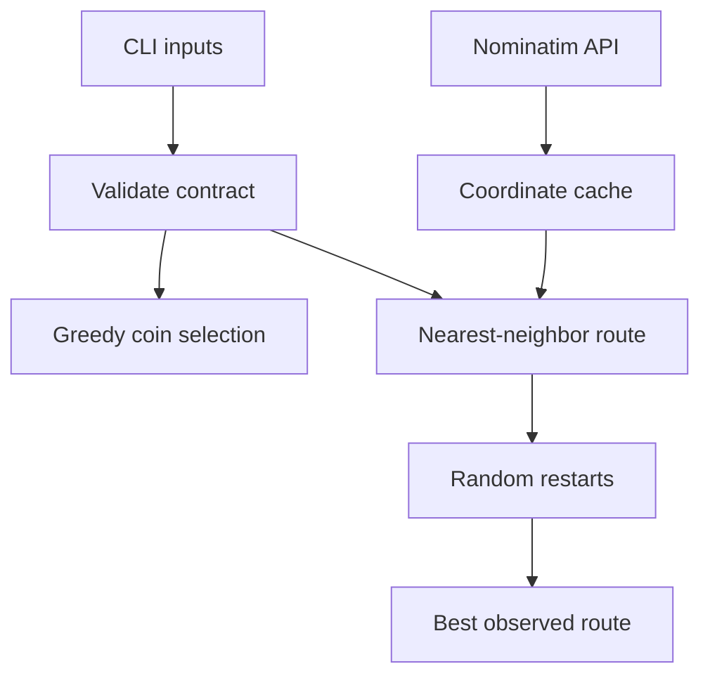

# Lab 04 — Optimization and Traveling Salesperson Heuristics

> **Chapter:** [02 — MLOps Foundations](../../README.md)
> **Status:** Complete
> **Focus:** Greedy optimization, nearest-neighbor search, deterministic random
> restarts, geocoding, caching, tests, and algorithmic limitations.

[← Previous lab: Reproducible EDA](../03-eda/) ·
[Chapter overview](../../README.md) ·
[Next lab: Flask ML API →](../05-flask-ml-api/)

## Overview

This lab contrasts a fast local decision with a globally optimal solution. It
implements two classic examples:

- greedy coin change, where the largest available denomination is selected
  first; and
- a Traveling Salesperson Problem (TSP) heuristic that repeatedly selects the
  nearest unvisited location.

The algorithms are intentionally understandable rather than globally optimal.
The engineering value comes from explicit input contracts, deterministic
experiments, tests, CLI interfaces, live-data isolation, and documented limits.

## Architecture



## Learning Objectives

- distinguish heuristic quality from guaranteed optimality;
- validate numeric and collection inputs;
- expose algorithms through testable Python functions and CLI entry points;
- use an explicit seed for repeatable random restarts;
- separate live API acquisition from offline computation;
- cache external results responsibly; and
- state the limits of the distance model.

## Project Layout

```text
04-optimization/
├── README.md
├── Makefile
├── requirements.txt
├── requirements.lock.txt
├── coin_change.py
├── tsp.py
├── restaurant_tsp.py
├── restaurant-coordinates.json
└── tests/
    ├── test_coin_change.py
    └── test_tsp.py
```

## Fedora Setup

```bash
cd ~/practical-mlops-book/chapters/02-mlops-foundations/labs/04-optimization
python3 -m venv .venv
source .venv/bin/activate
python -m pip install --upgrade pip
python -m pip install -r requirements.txt
```

## Quality Pipeline

Apply formatting after editing:

```bash
make format
```

Run all offline gates and deterministic examples:

```bash
make all
```

| Target | Responsibility |
|---|---|
| `make format` | Rewrite Python files with Black |
| `make format-check` | Verify formatting without changing files |
| `make lint` | Run Ruff against source and tests |
| `make test` | Run unit tests with coverage for core algorithms |
| `make coin` | Execute the 99-cent coin example |
| `make tsp` | Execute seeded random-restart TSP |
| `make restaurant-tsp` | Run the live/cached Alexandria exercise |
| `make all` | Run every offline quality gate and example |

## Part 1 — Greedy Coin Change

Run the canonical denomination example:

```bash
python coin_change.py 99
```

The algorithm:

1. sorts unique denominations from largest to smallest;
2. uses `divmod` to choose as many of the current denomination as possible;
3. carries the remainder forward; and
4. fails if the final remainder cannot be represented.

Demonstrate a greedy counterexample:

```bash
python coin_change.py 6 --coins 4 3 1
```

Greedy chooses `4 + 1 + 1`—three coins. The global optimum is `3 + 3`—two
coins. The result is valid but not optimal.

### Input Contract

- `amount` must be an integer and cannot be negative;
- booleans are rejected even though Python treats `bool` as an `int` subtype;
- the denomination collection cannot be empty; and
- every denomination must be a positive integer.

## Part 2 — Traveling Salesperson Heuristic

```bash
python tsp.py --iterations 1000 --seed 42
```

The workflow:

1. select a starting city using the seeded generator;
2. choose the nearest unvisited city;
3. repeat until every city is visited;
4. add the return edge to close the tour;
5. repeat from random starts; and
6. keep the shortest route observed.

### Why `pairwise()` Matters

`itertools.pairwise(route)` expresses successive route edges directly. It
replaced an earlier `zip(route, route[1:])` pattern after Ruff correctly
identified the clearer standard-library operation.

### Determinism

`random.Random(seed)` owns an isolated state. With the same coordinates,
iteration count, and seed, the sequence of selected starts is repeatable.

## Part 3 — Alexandria Coordinate Exercise

```bash
make restaurant-tsp
```

The script resolves configured Alexandria locations through OpenStreetMap
Nominatim. For each logical location it can try multiple query strings, applies
a 30-second timeout, sends an identifiable user agent, separates requests, and
caches successful coordinates.

### Cache Behavior

The cache is used only when its location names match the configured set exactly.
If configuration changes, the old cache is ignored instead of being combined
silently with incompatible data.

Inspect the cache:

```bash
python -m json.tool restaurant-coordinates.json
```

### Network Boundary

`make restaurant-tsp` is intentionally absent from `make all` and CI. Public API
availability, DNS, rate limits, or changed search results must not make an
offline code-quality workflow nondeterministic.

## Tests and Coverage

```bash
python -m pytest \
  -vv \
  --cov=coin_change \
  --cov=tsp \
  --cov-report=term-missing \
  tests
```

Tests protect successful outputs and rejected inputs. The live geocoder is kept
outside the unit-test contract because it crosses an external network boundary.

## One-Command Offline Validation

```bash
make all \
  && python tsp.py --iterations 1000 --seed 42 > /tmp/ch02-tsp-first.txt \
  && python tsp.py --iterations 1000 --seed 42 > /tmp/ch02-tsp-second.txt \
  && diff /tmp/ch02-tsp-first.txt /tmp/ch02-tsp-second.txt \
  && echo "Lab 04 offline validation passed"
```

The files are written under `/tmp`, not the repository, and may be deleted after
inspection.

## Known Limitations

- Euclidean distance over latitude/longitude is not road distance.
- Coordinate degrees are not uniform physical units everywhere on Earth.
- The heuristic does not guarantee an optimal tour.
- Nominatim search results can evolve.
- Production routing should use a road graph, travel time, vehicle constraints,
  and an appropriate routing engine.

## Common Failures

| Symptom | Cause | Recovery |
|---|---|---|
| Ruff reports `RUF007` | Successive items were iterated with `zip` | Use `itertools.pairwise()` |
| `EXE001` for a shebang | Script is not executable | Run `chmod +x SCRIPT.py` or remove the shebang intentionally |
| No coordinates found | Query is too specific or provider data changed | Add a reviewed fallback query; do not invent coordinates |
| HTTP or network error | Public service unavailable/rate-limited | Retry later or use the valid cache |
| Route changes unexpectedly | Seed, city order, coordinates, or iterations changed | Record all experiment inputs |

## MLOps Connection

- An algorithm can be operationally reliable without being globally optimal,
  provided its limits and acceptance criteria are explicit.
- Seeds, parameters, input coordinates, and code version are experiment lineage.
- External services need timeouts, error handling, caching, and CI isolation.
- A reproducible baseline is necessary before comparing a more advanced method.

## Completion Evidence

- [x] Black and Ruff pass
- [x] Unit tests and coverage pass
- [x] Coin-change CLI executes
- [x] Seeded TSP is deterministic
- [x] Alexandria coordinates are cached
- [x] Live exercise is isolated from offline CI

[← Previous lab: Reproducible EDA](../03-eda/) ·
[Next lab: Flask ML API →](../05-flask-ml-api/)
