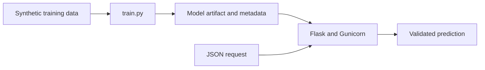

# Lab 05 — Flask Machine Learning API

This lab trains a deterministic regression model, stores evaluation metadata,
serves predictions through Flask, and packages the service as a non-root
container.

## Architecture



## Setup

```bash
cd chapters/02-mlops-foundations/labs/05-flask-ml-api
python3 -m venv .venv
source .venv/bin/activate
make install
```

## Quality Gates

```bash
make format
make all
```

`make all` verifies formatting, runs Ruff, trains the model, executes API tests,
and reports coverage.

## Train the Model

```bash
make train
```

Training records the model version, UTC timestamp, split sizes, dataset hash,
feature and target names, mean absolute error, and R-squared score.

## API Endpoints

| Method | Endpoint | Purpose |
|---|---|---|
| `GET` | `/health` | Process liveness |
| `GET` | `/ready` | Model readiness and version |
| `POST` | `/predict` | Validated weight prediction |

## Development and Production Servers

```bash
make run
```

```bash
make production
```

## Test a Prediction

```bash
curl \
  --silent \
  --request POST \
  --header "Content-Type: application/json" \
  --data '{"height_inches":70}' \
  http://127.0.0.1:8000/predict \
  | python -m json.tool
```

## Container Build

Build a Docker-format image with Podman so the health-check metadata is retained:

```bash
podman build \
  --format docker \
  --tag practical-mlops/ch02-api:1.0.0 \
  .
```

```bash
podman run \
  --detach \
  --rm \
  --name ch02-ml-api \
  --publish 8000:8000 \
  practical-mlops/ch02-api:1.0.0
```

Verify the non-root runtime:

```bash
podman exec ch02-ml-api id
```

```bash
podman stop ch02-ml-api
```

## Input Contract

`POST /predict` requires JSON containing a finite numeric `height_inches` value
between 40 and 100. Invalid content types, missing fields, nonnumeric values,
non-finite values, and out-of-range values are rejected.

## MLOps Lessons

- Training and serving are separate lifecycle stages.
- A model artifact needs metadata and lineage, not only a filename.
- Liveness and readiness answer different operational questions.
- Inference inputs require schema and range validation.
- The image builds as root but runs the application as `appuser`.
- CI tests application behavior and container construction.
