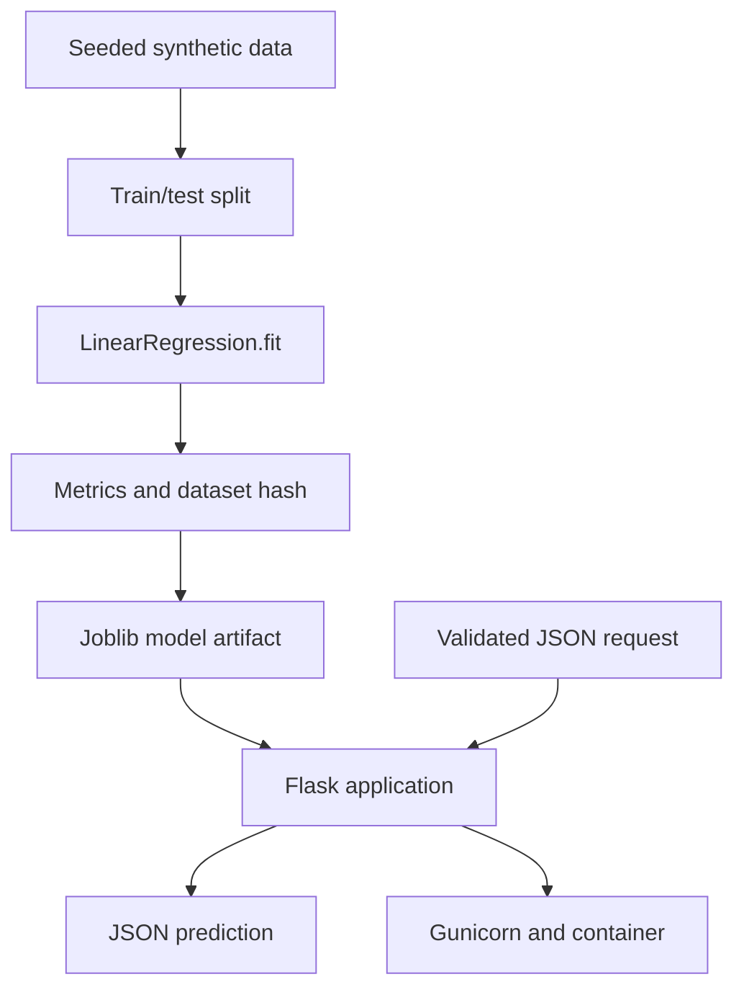

# Lab 05 — Flask Machine Learning API

> **Chapter:** [02 — MLOps Foundations](../../README.md)
> **Status:** Complete
> **Focus:** Deterministic training, evaluation metadata, model serialization,
> validated HTTP inference, tests, Gunicorn, non-root containers, and CI.

[← Previous lab: Optimization and TSP](../04-optimization/) ·
[Chapter overview](../../README.md) ·
[Continue to Chapter 3 →](../../../03-containers-and-edge-devices/)

## Overview

This lab implements the first complete model delivery path in the repository.
A deterministic synthetic dataset trains a linear regression model. Training
produces a serialized artifact and JSON metadata. Flask loads the artifact and
serves predictions behind explicit liveness, readiness, and input contracts.
The service is tested locally, run with Gunicorn, and packaged as a non-root
container.

## End-to-End Architecture



## Learning Objectives

- separate training from serving;
- build deterministic example training data;
- evaluate on a held-out test split;
- fingerprint the exact generated dataset;
- store a model together with operational metadata;
- expose liveness and model-aware readiness;
- validate content type, JSON shape, numeric type, finiteness, and range;
- test API success and failure paths;
- run Flask behind a production WSGI server; and
- build an image that runs as a non-login user.

## Project Layout

```text
05-flask-ml-api/
├── README.md
├── .dockerignore
├── Dockerfile
├── Makefile
├── app.py
├── train.py
├── requirements.txt
├── requirements.lock.txt
├── artifacts/                  # generated locally and during image build
│   ├── height-weight-model.joblib
│   └── metrics.json
└── tests/
    └── test_app.py
```

## Model Lifecycle

### Training input

`train.py` generates 2,000 rows from a fixed NumPy seed. Height is the single
feature; weight is the target with controlled random noise.

### Evaluation

The split reserves 20% of rows for testing and records:

- mean absolute error;
- R-squared;
- training and test row counts;
- model name and version;
- UTC training timestamp;
- feature and target names; and
- SHA-256 fingerprint of a canonical CSV representation.

### Serialized artifact

The Joblib artifact is a dictionary containing the estimator and metadata.
Only trusted artifacts should be loaded: Joblib/Pickle deserialization is not a
safe format for untrusted input.

## Fedora Setup

```bash
cd ~/practical-mlops-book/chapters/02-mlops-foundations/labs/05-flask-ml-api
python3 -m venv .venv
source .venv/bin/activate
python -m pip install --upgrade pip
python -m pip install -r requirements.txt
```

## Make Targets

| Target | Responsibility |
|---|---|
| `make install` | Install project dependencies |
| `make train` | Generate model and metadata artifacts |
| `make format` | Apply Black formatting |
| `make format-check` | Check formatting without modifying files |
| `make lint` | Run Ruff against application, trainer, and tests |
| `make test` | Train and run Pytest with coverage |
| `make run` | Train and start Flask's development server |
| `make production` | Train and start Gunicorn on port 8000 |
| `make all` | Format-check, lint, train, test, and report coverage |

## Quality Gates

```bash
make format
make all
```

Successful output includes seven passing API tests and terminal coverage for
`app.py` and `train.py`.

## Train and Inspect the Artifact

```bash
make train
```

Inspect human-readable metadata:

```bash
python -m json.tool artifacts/metrics.json
```

Inspect the artifact structure without executing the API:

```bash
python -c 'import joblib; a=joblib.load("artifacts/height-weight-model.joblib"); print(a["metadata"])'
```

## API Contract

| Method | Endpoint | Success | Purpose |
|---|---|---:|---|
| `GET` | `/health` | `200` | Confirms the web process is alive |
| `GET` | `/ready` | `200` or `503` | Confirms a model artifact is loaded |
| `POST` | `/predict` | `200` | Returns a validated weight prediction |

### Prediction input

```json
{
  "height_inches": 70
}
```

Contract rules:

- request `Content-Type` must be `application/json`;
- body must be a JSON object;
- `height_inches` must be numeric but not boolean;
- converted value must be finite; and
- accepted range is 40 through 100 inches.

### Prediction output

```json
{
  "input": {
    "height_inches": 70.0
  },
  "model": {
    "name": "height-weight-linear-regression",
    "version": "1.0.0"
  },
  "prediction": {
    "weight_pounds": 139.0
  }
}
```

The exact numeric prediction can vary only if training inputs or code change;
clients should rely on the schema rather than the illustrative value above.

## Run with Gunicorn

Start the production-style server in one terminal:

```bash
make production
```

From another terminal:

```bash
curl --fail --silent http://127.0.0.1:8000/health | jq .
curl --fail --silent http://127.0.0.1:8000/ready | jq .
```

Send a prediction:

```bash
curl \
  --fail \
  --silent \
  --request POST \
  --header 'Content-Type: application/json' \
  --data '{"height_inches":70}' \
  http://127.0.0.1:8000/predict \
  | jq .
```

Verify a rejected request and display its HTTP status:

```bash
curl \
  --silent \
  --request POST \
  --header 'Content-Type: application/json' \
  --data '{"height_inches":"invalid"}' \
  --write-out '\nHTTP %{http_code}\n' \
  http://127.0.0.1:8000/predict
```

Stop the foreground server with `Ctrl+C`.

## Container Workflow

Build Docker-format metadata with Podman:

```bash
podman build \
  --format docker \
  --tag localhost/practical-mlops-ch02-api:1.0.0 \
  .
```

Run the service:

```bash
podman run \
  --detach \
  --rm \
  --name ch02-ml-api \
  --publish 8000:8000 \
  localhost/practical-mlops-ch02-api:1.0.0
```

Validate runtime identity, readiness, and prediction:

```bash
podman exec ch02-ml-api id
curl --fail --silent http://127.0.0.1:8000/ready | jq .
curl \
  --fail \
  --silent \
  --request POST \
  --header 'Content-Type: application/json' \
  --data '{"height_inches":70}' \
  http://127.0.0.1:8000/predict \
  | jq .
```

Inspect logs and health state:

```bash
podman logs ch02-ml-api
podman inspect ch02-ml-api | jq '.[0].State'
```

Stop the service; `--rm` removes the stopped container automatically:

```bash
podman stop ch02-ml-api
```

## Container Security Decisions

- Python bytecode writing is disabled.
- stdout/stderr are unbuffered for log collection.
- dependency installation uses `--no-cache-dir`.
- the model is trained during image build.
- a non-login `appuser` owns and runs the application.
- only service port 8000 is documented.
- a health check probes the loopback endpoint.
- Gunicorn replaces Flask's development server.

## Test Coverage

The API tests cover:

- liveness;
- readiness;
- a successful prediction;
- missing height;
- invalid type;
- out-of-range height; and
- a non-JSON request.

## CI

The Chapter 2 workflow installs dependencies, runs `make all`, and builds the
container on a clean GitHub-hosted runner. This validates application behavior
and packaging independently of the local Fedora environment.

## Common Failures

| Symptom | Cause | Recovery |
|---|---|---|
| `unrecognized arguments: --cov` | `pytest-cov` is absent from the active interpreter | Activate `.venv` and run `make install` |
| Ruff `EXE001` | File has a shebang but is not executable | Run `chmod +x app.py train.py` or intentionally remove shebangs |
| `/ready` returns `503` | Model artifact was not created before app import | Run `make train`, then restart the server |
| Port 8000 already in use | Another local process/container owns the port | Inspect with `ss -ltnp`, stop the known process, or publish another host port |
| Container exits immediately | Gunicorn startup or model-loading failure | Read `podman logs ch02-ml-api` |

## Production Limitations

- The synthetic model is educational, not a medical or business predictor.
- Joblib is not a safe untrusted-artifact format.
- The image currently installs from direct requirements rather than a
  hash-verified supply-chain lock.
- Metrics and traces are not yet exported.
- Real deployments need authentication, authorization, rate limiting, request
  IDs, structured logs, resource limits, and model monitoring.

## MLOps and LLMOps Lessons

- A model artifact without lineage is operationally incomplete.
- Liveness and readiness answer different questions.
- Input validation protects the model and its callers.
- The serving runtime is part of the released model system.
- In LLMOps the same API layer must additionally validate generation settings,
  token limits, streaming behavior, safety policies, latency, and cost.

## Completion Evidence

- [x] Deterministic training data and split
- [x] Metrics and dataset hash recorded
- [x] Model and metadata artifacts generated
- [x] Seven API tests pass
- [x] Black and Ruff pass
- [x] Gunicorn serves the model
- [x] Non-root container builds and runs
- [x] Chapter CI builds the image

[← Previous lab: Optimization and TSP](../04-optimization/) ·
[Continue to Chapter 3 →](../../../03-containers-and-edge-devices/)
