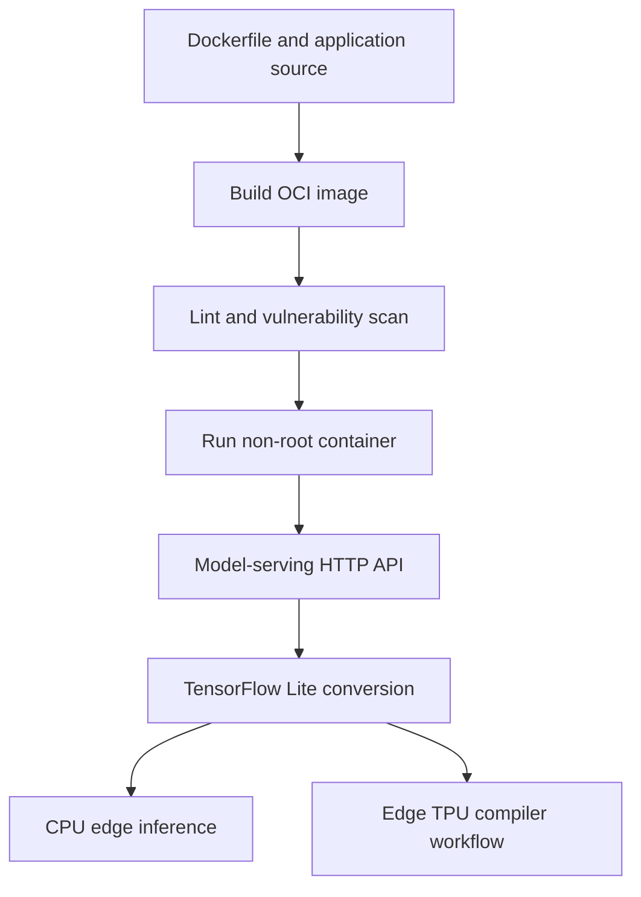

# Chapter 3 — MLOps for Containers and Edge Devices

[](https://github.com/moahmedzaghloula/practical-mlops-book/actions/workflows/chapter-03.yml)

> **Status:** Complete
> **Primary outcome:** Build, inspect, harden, scan, test, and operate model
> containers; then apply model-conversion and quantization concepts to an edge
> inference workflow.

[← Chapter 2](../02-mlops-foundations/) ·
[Repository home](../../README.md)

## Overview

Chapter 3 moves model delivery from a local Python process into portable
container images and constrained edge environments. The labs cover the complete
container lifecycle—Dockerfile authoring, image construction, runtime behavior,
registry naming, linting, vulnerability scanning, non-root execution, HTTP model
serving, health checks, TensorFlow Lite conversion, quantization, and the legacy
Edge TPU compiler path.

The implementation uses Fedora-native rootless Podman locally while retaining
Dockerfile compatibility for GitHub Actions and common registries.

## Learning Objectives

By completing the chapter, the repository demonstrates how to:

- distinguish a virtual machine, image, container, registry, engine, and
  low-level runtime;
- explain Linux namespaces, cgroups, SELinux labels, capabilities, and seccomp;
- author and inspect Dockerfile instructions and image layers;
- reason about `RUN`, `ENTRYPOINT`, `CMD`, build context, tags, and digests;
- debug a running container without installing SSH;
- lint Dockerfiles and scan OCI artifacts for known vulnerabilities;
- run application processes as a stable non-root UID/GID;
- package a trained model behind a validated HTTP API;
- use liveness, readiness, metadata, and prediction contracts;
- convert a neural network to TensorFlow Lite formats;
- explain dynamic and full-integer quantization; and
- document hardware and legacy dependency boundaries honestly.

## Chapter Architecture



## Lab Status

| Lab | Focus | Core evidence | Status |
|---:|---|---|---|
| [01](labs/01-container-basics/) | Container fundamentals | Fedora image, labels, entry point, runtime, and `exec` workflow | Complete |
| [02](labs/02-container-quality-security/) | Quality and security | Hadolint, non-root identity, OCI export, and Grype scan | Complete |
| [03](labs/03-model-serving-container/) | Containerized model API | Deterministic model, tests, metadata, Gunicorn, hardened image | Complete |
| [04](labs/04-edge-inference-cpu/) | CPU edge inference | Float, dynamic, and full-INT8 TensorFlow Lite artifacts | Complete |
| [05](labs/05-edge-tpu-compiler/) | Edge TPU compiler | Containerized compiler workflow and compatibility evidence | Complete* |

`*` The compiler workflow is complete. Execution against a physical Coral USB
Accelerator remains optional and hardware-dependent.

## Modernization Decisions

The source book contains historically valuable examples whose exact versions
are no longer suitable for the current Fedora environment. The repository keeps
the concepts while documenting deliberate replacements:

| Historical example | Repository implementation | Reason |
|---|---|---|
| CentOS Linux 8 image | Fedora 42 and current Python slim images | Use a maintained, Fedora-compatible path |
| Docker-only commands | Rootless Podman locally | Fedora-native engine and daemonless workflow |
| Boston Housing model | Deterministic synthetic regression dataset | Avoid a removed, ethically problematic dataset |
| Flask development server | Gunicorn for runtime validation | Use a production-style WSGI process manager |
| Azure Percept lab | Historical platform analysis | Product and associated services were retired |
| Old PyCoral wheels | CPU simulation plus isolated compiler workflow | Current Python/platform compatibility is limited |

## Repository Layout

```text
03-containers-and-edge-devices/
├── README.md
└── labs/
    ├── 01-container-basics/
    │   ├── README.md
    │   ├── Dockerfile
    │   └── .dockerignore
    ├── 02-container-quality-security/
    │   ├── README.md
    │   ├── Dockerfile
    │   └── Makefile
    ├── 03-model-serving-container/
    │   ├── README.md
    │   ├── Dockerfile
    │   ├── Makefile
    │   ├── app.py
    │   ├── train.py
    │   └── tests/
    ├── 04-edge-inference-cpu/
    │   ├── README.md
    │   ├── Dockerfile
    │   ├── convert_and_infer.py
    │   └── artifacts/
    └── 05-edge-tpu-compiler/
        ├── README.md
        ├── Dockerfile
        └── models/
```

Generated model binaries, OCI archives, caches, and virtual environments are
excluded from Git unless a lab explicitly documents a small educational
artifact as versioned evidence.

## Fedora Prerequisites

```bash
sudo dnf install -y \
  python3 \
  python3-pip \
  git \
  make \
  podman \
  buildah \
  skopeo \
  fuse-overlayfs \
  curl \
  jq \
  usbutils
```

Verify rootless execution:

```bash
podman version
podman info --format '{{.Host.Security.Rootless}}'
```

Expected rootless result:

```text
true
```

## Recommended Execution Order

1. [Container Basics](labs/01-container-basics/) establishes vocabulary and
   process lifecycle.
2. [Container Quality and Security](labs/02-container-quality-security/) adds
   linting, non-root execution, and CVE visibility.
3. [Model Serving Container](labs/03-model-serving-container/) packages the
   complete training-and-inference contract.
4. [CPU Edge Inference](labs/04-edge-inference-cpu/) produces and benchmarks
   TensorFlow Lite variants.
5. [Edge TPU Compiler](labs/05-edge-tpu-compiler/) isolates the legacy compiler
   and records the hardware boundary.

## Core Container Vocabulary

| Term | Meaning in this repository |
|---|---|
| Image | Immutable, content-addressed filesystem and runtime configuration |
| Container | Runtime instance of an image with a writable layer and isolated process view |
| Registry | Remote service that stores and distributes image manifests and layers |
| Repository | Named image collection inside a registry |
| Tag | Human-readable, mutable pointer such as `1.0.0` or `latest` |
| Digest | Immutable content identifier such as `sha256:...` |
| Engine | High-level lifecycle tool such as Podman or Docker Engine |
| OCI runtime | Low-level process runtime such as `crun` or `runc` |

## Quality-Gate Strategy

```text
Dockerfile lint
    ↓
application format and lint
    ↓
unit/API tests and coverage
    ↓
container build
    ↓
non-root smoke test
    ↓
vulnerability report
    ↓
HTTP health/readiness/prediction checks
```

Security scan results are evaluated in context. A CVE report is not hidden, but
severity alone does not prove exploitability. Release decisions should consider
reachability, exposure, available fixes, base-image freshness, and compensating
controls.

## Chapter CI

The Chapter 3 workflow validates the hardware-independent contract on hosted
runners:

- build and run the fundamentals image;
- lint and build the hardened image;
- verify its non-root identity;
- install, format-check, lint, and test the model API;
- build the model-serving image; and
- smoke-test its health endpoint.

TensorFlow conversion and physical Edge TPU execution are not placed on every
pull request because of image size, runtime cost, legacy dependencies, and
hardware availability. In production they belong in scheduled or self-hosted
hardware-in-the-loop pipelines.

## Operational Security Standards

- Use fully qualified image names.
- Pin important versions and define an update cadence.
- Never place credentials in `ARG`, `ENV`, build context, or image layers.
- Keep build context small with `.dockerignore`.
- Run as a non-root numeric UID/GID.
- Drop capabilities and prefer a read-only root filesystem.
- Write logs to stdout/stderr.
- Expose liveness and readiness independently.
- scan OS and language dependencies.
- use immutable digests for controlled promotion where practical.

## Edge Delivery Model

Edge inference trades cloud elasticity for proximity to the data source. It can
reduce latency, bandwidth use, and connectivity dependence, but introduces
constraints around memory, power, architecture, updates, observability, model
size, physical security, and fleet management.

Quantization is therefore treated as an engineering decision with measurable
size, latency, and accuracy consequences—not as a blind conversion step.

## Managed ML Connection

Managed systems such as SageMaker, Azure Machine Learning, and Vertex AI use
containers to standardize training and inference execution. The registry image,
model artifact, dataset location, and runtime metadata together form the
deployable ML release—not the estimator file alone.

## LLMOps Connection

The same chapter patterns extend to large-model serving:

- image variants for CPU, CUDA, ROCm, and ARM64;
- model and tokenizer lineage;
- quantized weight formats;
- GPU-aware scheduling and health checks;
- large artifact download and local caching;
- streaming API contracts;
- latency, throughput, token, and cost telemetry; and
- signed images and controlled supply chains.

## Completion Criteria

- [x] Rootless Podman environment verified
- [x] Image build, inspection, tagging, and runtime commands completed
- [x] Interactive and non-interactive `podman exec` demonstrated
- [x] Hadolint Dockerfile gate completed
- [x] Grype OCI image scan completed
- [x] Non-root hardened image validated
- [x] Model API tests and container smoke test completed
- [x] Float and quantized TensorFlow Lite models produced
- [x] Edge TPU compiler workflow documented and executed
- [x] Chapter CI and professional documentation added

## Key Takeaways

- A container is an isolated process environment, not a complete virtual
  machine.
- The image, model, configuration, and metadata form one release contract.
- Tags are convenient; digests provide immutable identity.
- Runtime hardening and vulnerability visibility belong in the delivery path.
- Edge deployment requires explicit model, runtime, architecture, and hardware
  compatibility.
- Build-once/run-many means consistent lineage and automation, not universal
  binary compatibility across every device.

[← Chapter 2](../02-mlops-foundations/) ·
[Repository home](../../README.md)
