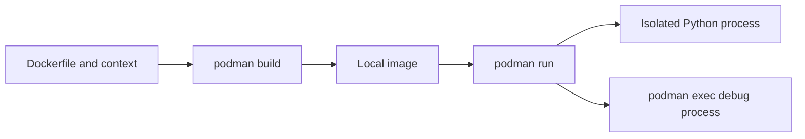

# Lab 01 — Container Fundamentals with Podman

> **Chapter:** [03 — MLOps for Containers and Edge Devices](../../README.md)
> **Status:** Complete
> **Focus:** Dockerfile anatomy, build context, image metadata, layers, tags,
> container lifecycle, entry points, command overrides, and runtime debugging.

[← Chapter overview](../../README.md) ·
[Next lab: Quality and Security →](../02-container-quality-security/)

## Objective

Build a small Fedora-based Python image and use it to understand every stage
between a Dockerfile and a running process. The lab uses rootless Podman, but
the Dockerfile remains compatible with Docker-compatible builders.

## Mental Model



An image is a reusable build artifact. A container is a runtime instance of
that image. The container remains alive only while its primary process is
alive.

## Files

| File | Purpose |
|---|---|
| `Dockerfile` | Defines the Fedora base, metadata, Python installation, entry point, and default command |
| `.dockerignore` | Excludes irrelevant or sensitive build-context files |
| `README.md` | Documents the operational contract |

## Prerequisites

```bash
sudo dnf install -y podman buildah skopeo fuse-overlayfs jq
podman version
podman info --format '{{.Host.Security.Rootless}}'
```

## Build the Image

```bash
cd ~/practical-mlops-book/chapters/03-containers-and-edge-devices/labs/01-container-basics
podman build \
  --build-arg APP_VERSION=1.0.0 \
  --tag localhost/ch03-container-basics:1.0.0 \
  .
```

Command anatomy:

| Element | Meaning |
|---|---|
| `podman build` | Execute the image build |
| `--build-arg` | Supply a non-secret build-time value |
| `--tag` | Attach a human-readable repository and tag |
| `localhost/` | Make the local image namespace explicit |
| `.` | Use the current directory as build context |

## Inspect the Build Artifact

```bash
podman images localhost/ch03-container-basics
podman history --no-trunc localhost/ch03-container-basics:1.0.0
podman image inspect \
  localhost/ch03-container-basics:1.0.0 \
  | jq '.[0].Config'
```

Verify OCI labels:

```bash
podman image inspect \
  localhost/ch03-container-basics:1.0.0 \
  | jq '.[0].Config.Labels'
```

## Run the Default Contract

```bash
podman run --rm localhost/ch03-container-basics:1.0.0
```

The image combines:

```text
ENTRYPOINT ["/usr/bin/python3"]
CMD ["--version"]
```

so the runtime command is effectively:

```text
/usr/bin/python3 --version
```

## Override the Default Arguments

Arguments after the image name replace `CMD` and remain attached to
`ENTRYPOINT`:

```bash
podman run \
  --rm \
  localhost/ch03-container-basics:1.0.0 \
  -c 'print("Hello from Chapter 3")'
```

## Debug a Long-Running Container

Create a named Fedora container whose primary process stays alive:

```bash
podman run \
  --detach \
  --interactive \
  --tty \
  --name ch03-debug \
  --rm \
  registry.fedoraproject.org/fedora:42 \
  sleep infinity
```

List it:

```bash
podman ps
```

Open an interactive shell without SSH:

```bash
podman exec --interactive --tty ch03-debug bash
```

Inside the container:

```bash
whoami
hostname
cat /etc/fedora-release
ps -ef
exit
```

Run a non-interactive diagnostic:

```bash
podman exec ch03-debug cat /etc/fedora-release
```

Stop the named container; `--rm` removes it afterward:

```bash
podman stop ch03-debug
```

## Tag and Identity

Create another mutable tag pointing to the same local image:

```bash
podman tag \
  localhost/ch03-container-basics:1.0.0 \
  localhost/ch03-container-basics:latest
```

Compare IDs:

```bash
podman images localhost/ch03-container-basics
```

Tags are movable names. Digests provide content identity and are safer for
controlled promotion.

## Validation

```bash
podman run \
  --rm \
  localhost/ch03-container-basics:1.0.0 \
  | grep --extended-regexp '^Python 3\.13\.' \
  && echo "Lab 01 validation passed"
```

The check intentionally validates the `Python 3.13.x` series instead of one
patch release. A maintained Fedora image can receive a security update without
changing the lab's major/minor runtime contract.

## Common Failures

| Symptom | Cause | Recovery |
|---|---|---|
| Short-name resolution prompt | Image name is not fully qualified | Use the documented registry prefix |
| Build context is unexpectedly large | `.dockerignore` is missing or incomplete | Inspect the context and exclude irrelevant files |
| Container exits immediately | Primary process completed | This is normal for one-shot commands; use a long-running PID 1 for debugging |
| `podman exec` cannot find the container | Container stopped or name differs | Inspect `podman ps --all` |
| Permission/SELinux problem on a mount | Host path lacks suitable labeling | Use an intentional `:Z` or `:z` label based on sharing requirements |

## Production Lessons

- Containers do not need SSH for normal administration.
- PID 1 lifecycle determines container lifecycle.
- Build context is a security boundary.
- `ARG` and image layers are not secret stores.
- Fully qualified names and immutable identities reduce ambiguity.
- Debug commands should not become permanent production packages unless needed.

## Completion Evidence

- [x] Image builds with an explicit version label
- [x] Default Python command succeeds
- [x] Runtime arguments override `CMD`
- [x] Image metadata and history inspected
- [x] Interactive and non-interactive `exec` demonstrated
- [x] Named debug container removed cleanly

[← Chapter overview](../../README.md) ·
[Next lab: Quality and Security →](../02-container-quality-security/)
