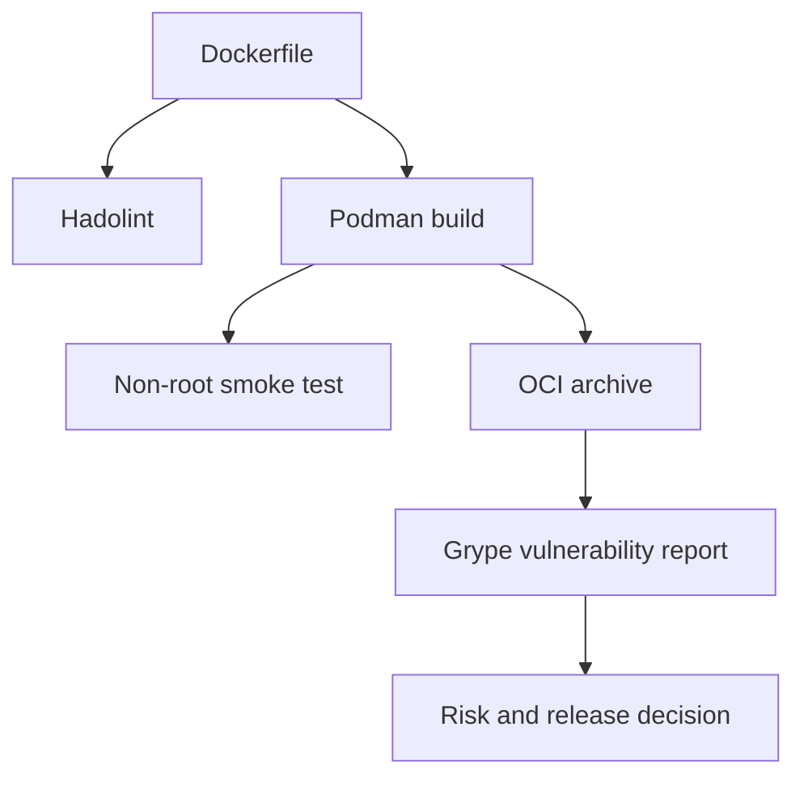

# Lab 02 — Container Quality and Security

> **Chapter:** [03 — MLOps for Containers and Edge Devices](../../README.md)
> **Status:** Complete
> **Focus:** Dockerfile linting, stable non-root identity, image inspection,
> OCI archive export, vulnerability scanning, and policy-aware release gates.

[← Previous lab: Container Fundamentals](../01-container-basics/) ·
[Chapter overview](../../README.md) ·
[Next lab: Model Serving Container →](../03-model-serving-container/)

## Objective

Turn a container that merely runs into an artifact with enforceable quality and
security properties. The lab separates three different questions:

1. Is the Dockerfile written according to maintainability conventions?
2. Does the runtime process have the intended identity and minimal privilege?
3. What known vulnerabilities are present in the complete image dependency
   graph?

## Quality and Security Flow



## Files

| File | Purpose |
|---|---|
| `Dockerfile` | Creates a minimal Python image and stable non-root user |
| `Makefile` | Automates lint, build, smoke test, scan, and cleanup |
| `README.md` | Defines the quality and security runbook |
| `ch03-hardened.oci.tar` | Generated scan input; excluded from Git |

## Security Decisions in the Image

- a versioned Python slim base is used;
- OCI labels describe the artifact;
- Python bytecode writes are disabled;
- Python output is unbuffered;
- a numeric UID/GID (`10001:10001`) is created explicitly;
- the account uses a non-login shell; and
- runtime execution switches away from root.

These decisions reduce privilege and ambiguity but do not make the image
invulnerable. Scanning and update management remain required.

## Prerequisites

```bash
sudo dnf install -y podman make jq
```

Hadolint and Grype run as containers, so no unsupported host binary installer is
required.

## Run the Mandatory Gates

```bash
cd ~/practical-mlops-book/chapters/03-containers-and-edge-devices/labs/02-container-quality-security
make verify
```

`make verify` performs:

```text
Hadolint → image build → non-root smoke test
```

Run gates independently when diagnosing:

```bash
make lint
make build
make smoke
```

## Hadolint

The lint target is equivalent to:

```bash
podman run \
  --rm \
  --interactive \
  docker.io/hadolint/hadolint:v2.14.0 \
  < Dockerfile
```

Hadolint can identify issues such as unpinned dependencies, unsafe shell
patterns, missing cleanup, and weak Dockerfile conventions. A clean report means
the configured rules pass; it does not prove runtime security.

## Verify Runtime Identity

```bash
podman run \
  --rm \
  localhost/ch03-hardened:0.1.0 \
  -c 'import os; print(f"uid={os.getuid()} gid={os.getgid()}")'
```

Expected output:

```text
uid=10001 gid=10001
```

Inspect the configured user without starting the application:

```bash
podman image inspect \
  localhost/ch03-hardened:0.1.0 \
  | jq -r '.[0].Config.User'
```

## Export the Image as OCI

```bash
podman save \
  --format oci-archive \
  --output ch03-hardened.oci.tar \
  localhost/ch03-hardened:0.1.0
```

Why export?

- the scanner container does not automatically share the rootless Podman image
  store;
- OCI archive is a portable standard input; and
- the scan targets the exact built artifact rather than a similarly named
  remote image.

## Vulnerability Scan

```bash
podman run \
  --rm \
  --volume "$PWD:/scan:Z" \
  docker.io/anchore/grype:v0.110.0 \
  oci-archive:/scan/ch03-hardened.oci.tar
```

The report may include findings from:

- operating-system packages;
- Python or language packages;
- native shared libraries; and
- transitive dependencies.

## Severity Gate

```bash
podman run \
  --rm \
  --volume "$PWD:/scan:Z" \
  docker.io/anchore/grype:v0.110.0 \
  oci-archive:/scan/ch03-hardened.oci.tar \
  --fail-on high
```

This command intentionally returns non-zero when the report contains a finding
at or above `High`. Inspect the exit code:

```bash
echo $?
```

A mature release policy should also account for fix availability, reachability,
internet exposure, exploitability, exceptions, owners, and remediation dates.

## Make Targets

| Target | Purpose |
|---|---|
| `make lint` | Validate Dockerfile conventions |
| `make build` | Build the tagged local image |
| `make smoke` | Assert the runtime UID is 10001 |
| `make scan` | Export and scan the image |
| `make verify` | Run mandatory deterministic gates |
| `make clean` | Remove only the generated OCI archive |

## Validation

```bash
make verify \
  && test "$(podman image inspect localhost/ch03-hardened:0.1.0 | jq -r '.[0].Config.User')" = "10001:10001" \
  && echo "Lab 02 validation passed"
```

## Common Failures

| Symptom | Cause | Recovery |
|---|---|---|
| Hadolint returns a rule ID | Dockerfile violates a configured convention | Read the rule, fix the cause, and rerun; do not suppress blindly |
| Smoke test reports UID 0 | `USER` is missing, overridden, or placed incorrectly | Inspect Dockerfile order and image configuration |
| Grype cannot open the archive | Wrong mount path, missing archive, or SELinux denial | Re-run export and retain `:Z` on the bind mount |
| Security gate suddenly fails | Vulnerability database changed or new CVE was disclosed | Review the new finding and remediate or record a time-bounded exception |
| Docker Hub rate limit | Anonymous pulls exceeded provider limits | Authenticate appropriately or use an approved mirror/cache |

## Production Improvements

- pin base images by digest while retaining readable version tags;
- generate an SBOM during build;
- sign released images and verify signatures during deployment;
- use automated dependency updates;
- set resource, filesystem, capability, and network restrictions at runtime;
- store scan evidence with the release; and
- define measurable vulnerability remediation SLAs.

## LLMOps Connection

LLM images often include CUDA, tokenizers, inference servers, native kernels,
and many transitive packages. Their size and complexity increase supply-chain
risk, so SBOMs, signed provenance, non-root execution, and continuous CVE
visibility become even more important.

## Completion Evidence

- [x] Hadolint passes
- [x] Hardened image builds
- [x] Runtime UID/GID are non-root and stable
- [x] OCI archive exported
- [x] Grype report generated
- [x] Severity-gate behavior observed
- [x] Generated archive excluded from Git

[← Previous lab: Container Fundamentals](../01-container-basics/) ·
[Next lab: Model Serving Container →](../03-model-serving-container/)
