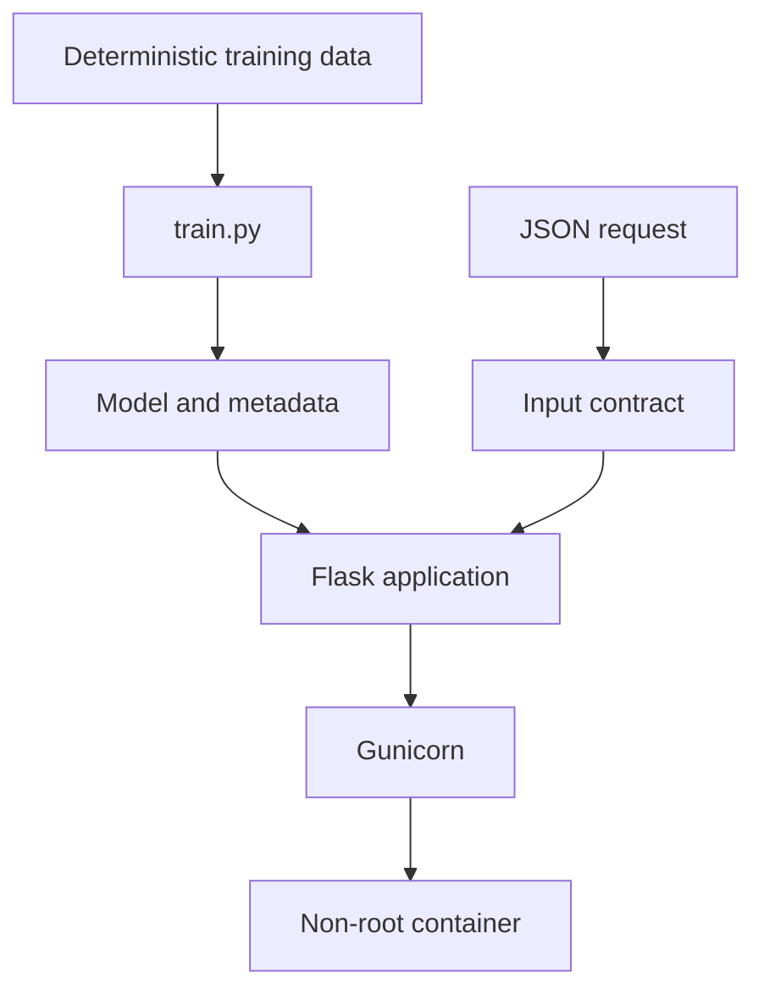

# Lab 03 — Production-Style Model Serving Container

> **Chapter:** [03 — MLOps for Containers and Edge Devices](../../README.md)
> **Status:** Complete
> **Focus:** Deterministic training, dependency locking, model metadata, HTTP
> contracts, tests, multi-stage builds, Gunicorn, and runtime hardening.

[← Previous lab: Quality and Security](../02-container-quality-security/) ·
[Chapter overview](../../README.md) ·
[Next lab: CPU Edge Inference →](../04-edge-inference-cpu/)

## Objective

Build a self-contained image that serves a trusted model artifact through a
validated HTTP API. The lab improves on the Chapter 2 service by making model
metadata discoverable, using a multi-stage dependency build, and demonstrating
additional runtime controls.

The synthetic regression problem is educational; the delivery pattern is the
real product of the lab.

## Architecture



## Project Layout

```text
03-model-serving-container/
├── README.md
├── .dockerignore
├── Dockerfile
├── Makefile
├── app.py
├── train.py
├── requirements.txt
├── requirements-dev.txt
├── requirements.lock.txt
├── model/                      # generated
│   ├── model.joblib
│   └── metadata.json
└── tests/
    ├── test_app.py
    └── test_train.py
```

## Model Contract

| Property | Value |
|---|---|
| Problem | Single-feature regression |
| Feature | `height_cm` |
| Target | `weight_kg` |
| Algorithm | `LinearRegression` |
| Data | Deterministic synthetic dataset |
| Seed | `42` |
| Artifact | Joblib bundle containing estimator and metadata |
| Dataset identity | SHA-256 fingerprint |

The artifact must be trusted before deserialization. Joblib and Pickle formats
can execute code while loading and are not safe exchange formats for untrusted
files.

## Fedora Setup

```bash
cd ~/practical-mlops-book/chapters/03-containers-and-edge-devices/labs/03-model-serving-container
python3 -m venv .venv
source .venv/bin/activate
python -m pip install --upgrade pip
python -m pip install -r requirements.txt
python -m pip freeze > requirements.lock.txt
python -m pip install -r requirements-dev.txt
```

The runtime lock is generated before installing development-only tools so the
container does not inherit Black, Ruff, Pytest, or coverage packages.

## Local Quality Gates

```bash
make format
make all
```

| Target | Purpose |
|---|---|
| `make install` | Install development and runtime dependencies |
| `make train` | Generate the model artifact and metadata |
| `make format` | Apply Black |
| `make format-check` | CI-safe formatting gate |
| `make lint` | Run Ruff |
| `make test` | Train, run tests, and report coverage |
| `make all` | Run the complete local quality contract |
| `make container-build` | Build the versioned model API image |

## API Contract

| Method | Endpoint | Purpose |
|---|---|---|
| `GET` | `/` | Discover endpoints and an example payload |
| `GET` | `/health` | Process liveness |
| `GET` | `/ready` | Model readiness and version |
| `GET` | `/metadata` | Safe model lineage and training metadata |
| `POST` | `/predict` | Validate input and return inference |

### Valid request

```json
{
  "height_cm": 175.0
}
```

### Validation rules

- request must use `application/json`;
- body must be a JSON object;
- `height_cm` is required;
- booleans and nonnumeric values are rejected; and
- value must be between 100 and 250 centimeters.

## Container Build

```bash
make container-build
```

Equivalent explicit command:

```bash
podman build \
  --build-arg MODEL_VERSION=1.0.0 \
  --tag localhost/ch03-model-api:1.0.0 \
  .
```

## Multi-Stage Build Responsibilities

### Builder stage

- reads the resolved dependency lock;
- creates wheels in an isolated directory; and
- keeps dependency acquisition separate from the runtime filesystem.

### Runtime stage

- creates the stable non-root account;
- installs only from the built wheel directory;
- copies application and training code;
- trains and embeds the model artifact;
- changes ownership; and
- starts Gunicorn as UID/GID `10001:10001`.

In a larger production system, training would normally be a separate pipeline
and the approved model artifact would be supplied by a model registry. Training
inside the image build is retained here to make artifact lineage visible in one
reproducible educational unit.

## Hardened Runtime

```bash
podman run \
  --detach \
  --name ch03-model-api \
  --publish 8000:8000 \
  --read-only \
  --tmpfs /tmp:rw,noexec,nosuid,size=64m \
  --cap-drop=all \
  --security-opt=no-new-privileges \
  localhost/ch03-model-api:1.0.0
```

| Control | Purpose |
|---|---|
| `--read-only` | Prevent writes to the image root filesystem |
| `--tmpfs /tmp` | Provide bounded ephemeral writable space |
| `noexec,nosuid` | Reduce executable and set-ID behavior in `/tmp` |
| `--cap-drop=all` | Remove unnecessary Linux capabilities |
| `no-new-privileges` | Prevent privilege gain through execution |

## Validate the Service

```bash
curl --fail --silent http://127.0.0.1:8000/ | jq .
curl --fail --silent http://127.0.0.1:8000/health | jq .
curl --fail --silent http://127.0.0.1:8000/ready | jq .
curl --fail --silent http://127.0.0.1:8000/metadata | jq .
```

Prediction:

```bash
curl \
  --fail \
  --silent \
  --request POST \
  --header 'Content-Type: application/json' \
  --data '{"height_cm":175.0}' \
  http://127.0.0.1:8000/predict \
  | jq .
```

Invalid input:

```bash
curl \
  --silent \
  --request POST \
  --header 'Content-Type: application/json' \
  --data '{"height_cm":"tall"}' \
  --write-out '\nHTTP %{http_code}\n' \
  http://127.0.0.1:8000/predict
```

## Runtime Inspection

```bash
podman exec ch03-model-api id
podman logs ch03-model-api
podman healthcheck run ch03-model-api
podman inspect ch03-model-api | jq '.[0].State'
```

Stop and remove the named container:

```bash
podman stop ch03-model-api
podman rm ch03-model-api
```

## Test Scope

The automated suite validates:

- deterministic dataset identity;
- model and metadata file creation;
- home endpoint documentation;
- liveness and readiness;
- metadata schema;
- valid prediction response;
- missing feature rejection;
- string and boolean rejection;
- range rejection; and
- non-JSON rejection.

## One-Command Validation

```bash
source .venv/bin/activate \
  && make all \
  && make container-build \
  && podman run --rm localhost/ch03-model-api:1.0.0 \
       python -c 'import os; assert os.getuid() == 10001' \
  && echo "Lab 03 build validation passed"
```

If the image uses a fixed Gunicorn `ENTRYPOINT` rather than a shell-compatible
command override, validate the user with `podman image inspect` or a temporary
`--entrypoint python` override instead.

## Common Failures

| Symptom | Cause | Recovery |
|---|---|---|
| App import cannot find the model | `make train` was not run locally | Generate the artifact before local tests/server startup |
| Lock file is missing during build | Runtime dependencies were installed but not frozen | Recreate `requirements.lock.txt` in the documented order |
| Health state remains `starting` | Gunicorn startup or model load is slow/failing | Inspect logs and run the health check manually |
| Read-only container crashes | Application tries to write outside `/tmp` | Identify the write path; mount only the required writable location |
| Prediction returns `400` | Payload violates type/range contract | Compare the request with the documented schema |

## Production Improvements

- train in a separate controlled pipeline;
- promote an approved artifact by immutable identity;
- verify package and image signatures;
- add structured logs, request IDs, metrics, and tracing;
- configure resource limits and autoscaling;
- authenticate and authorize callers;
- monitor latency, error rate, input drift, and model quality; and
- use staged rollout and rollback policies.

## LLMOps Connection

An LLM serving container follows the same contract but adds model/tokenizer
downloads, GPU runtime compatibility, quantized weight variants, streaming,
batching, token limits, safety controls, and cost/latency telemetry.

## Completion Evidence

- [x] Runtime dependency lock generated
- [x] Deterministic model and metadata created
- [x] Formatter, linter, tests, and coverage pass
- [x] Multi-stage image builds
- [x] API runs as non-root
- [x] Read-only hardened runtime succeeds
- [x] All endpoint contracts validated

[← Previous lab: Quality and Security](../02-container-quality-security/) ·
[Next lab: CPU Edge Inference →](../04-edge-inference-cpu/)
