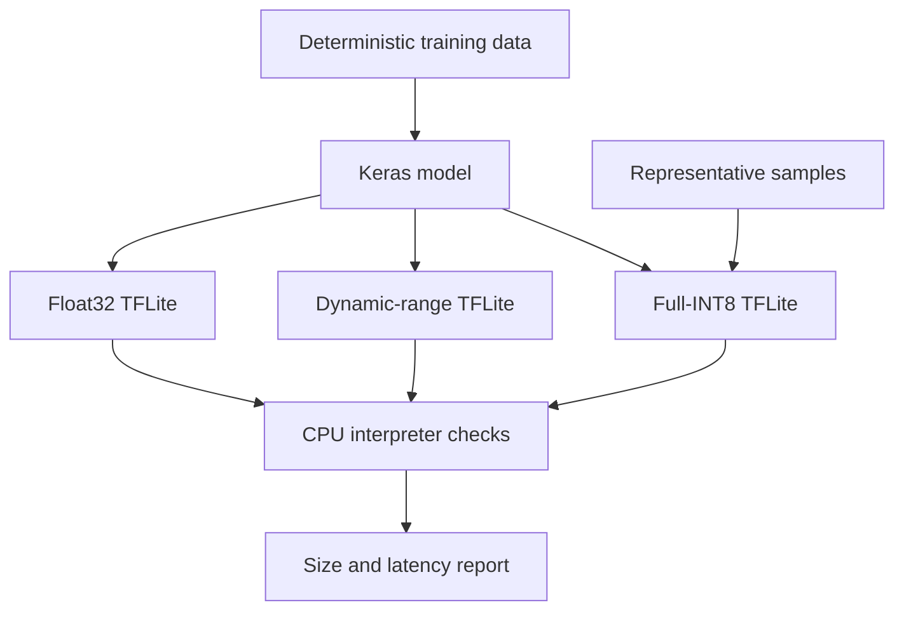

# Lab 04 — TensorFlow Lite Conversion and CPU Edge Inference

> **Chapter:** [03 — MLOps for Containers and Edge Devices](../../README.md)
> **Status:** Complete
> **Focus:** Portable model conversion, post-training quantization,
> representative datasets, artifact inspection, and repeatable CPU inference.

[← Previous lab: Model Serving Container](../03-model-serving-container/) ·
[Chapter overview](../../README.md) ·
[Next lab: Edge TPU Compiler →](../05-edge-tpu-compiler/)

## Objective

Train a small deterministic neural network, convert it into three TensorFlow
Lite variants, run each artifact through the TensorFlow Lite interpreter, and
compare their storage and runtime characteristics. The lab emulates the model
preparation stage of an edge deployment without requiring specialized hardware.

The goal is not to declare one format universally best. The goal is to produce
evidence about the tradeoff among model size, numerical precision, supported
operators, latency, and target-hardware compatibility.

## Workflow



## Files and Generated Artifacts

| Path | Purpose | Git policy |
|---|---|---|
| `Dockerfile` | Provides a TensorFlow-compatible conversion environment | Track |
| `convert_and_infer.py` | Trains, converts, validates, and benchmarks the model variants | Track |
| `README.md` | Documents the reproducible runbook and engineering decisions | Track |
| `artifacts/model-float.tflite` | Baseline Float32 TensorFlow Lite model | Generate |
| `artifacts/model-dynamic.tflite` | Dynamically quantized model | Generate |
| `artifacts/model-full-int8.tflite` | Fully integer-quantized model | Generate |

Generated model files are build artifacts. They should be published through an
artifact store or model registry in a production workflow rather than committed
automatically to source control.

## Why TensorFlow Lite Exists

TensorFlow Lite is an inference-oriented runtime and model format designed for
constrained targets such as mobile, embedded, ARM, and edge systems. Conversion
can reduce the runtime surface and enable hardware-specific optimizations, but
it creates a new artifact that must be tested independently from the original
training model.

The deployment lineage is therefore:

```text
training code + dataset identity + configuration
    → trained Keras model
    → converter configuration
    → TFLite artifact
    → target-runtime validation
```

Each arrow is a transformation that can change compatibility or numerical
behavior and must be recorded.

## Quantization Variants

| Variant | Typical representation | Representative dataset | Main benefit | Main risk |
|---|---|---:|---|---|
| Float32 | Float weights and activations | No | Strong compatibility baseline | Largest artifact and memory footprint |
| Dynamic range | Quantized weights; activations converted dynamically | No | Easy size reduction | Runtime conversion overhead and target-dependent speedup |
| Full INT8 | Integer weights and activations | Yes | Best fit for integer accelerators | Calibration error and unsupported operations |

Quantization reduces numerical precision. It is a deployment optimization, not
lossless compression. A smaller file does not by itself prove that predictions
remain acceptable.

## Representative Dataset

Full-integer conversion needs representative input samples so the converter can
estimate activation ranges. These samples are calibration data, not a second
training pass.

A useful representative dataset should:

- follow the exact input shape and data type expected by the model;
- cover normal production ranges and important edge cases;
- use the same preprocessing contract as inference;
- avoid secrets and unnecessary personal data; and
- be versioned or fingerprinted so the conversion can be reproduced.

Poor calibration data can produce a technically valid INT8 file with degraded
real-world predictions.

## Prerequisites

The TensorFlow dependency is isolated inside the image. This avoids forcing a
host installation whose wheel availability may not match Fedora's newest
Python version.

```bash
sudo dnf install -y podman jq
podman version
podman info --format '{{.Host.Security.Rootless}}'
```

## Build the Conversion Image

```bash
cd ~/practical-mlops-book/chapters/03-containers-and-edge-devices/labs/04-edge-inference-cpu
podman build \
  --tag localhost/ch03-edge-inference:1.0.0 \
  .
```

Command anatomy:

| Element | Meaning |
|---|---|
| `podman build` | Executes the Dockerfile and creates an OCI image |
| `--tag` | Assigns a readable local image identity |
| `localhost/` | Makes the local, unpushed image namespace explicit |
| `1.0.0` | Versions the conversion environment |
| `.` | Sends the current directory as build context |

## Generate the Models

Create a host output directory first:

```bash
mkdir -p artifacts
```

Run the conversion pipeline:

```bash
podman run \
  --rm \
  --volume "$PWD/artifacts:/output:Z" \
  localhost/ch03-edge-inference:1.0.0
```

The flags matter:

| Flag | Purpose |
|---|---|
| `--rm` | Removes the stopped container while preserving host artifacts |
| `--volume` | Maps the host output directory to `/output` in the container |
| `:Z` | Applies a private SELinux label appropriate for this container |

The script should train once, convert all variants, allocate the appropriate
interpreter tensors, adapt input data to each model's declared dtype and
quantization parameters, execute inference, and report the results.

## Inspect the Artifacts

```bash
find artifacts \
  -maxdepth 1 \
  -type f \
  -name '*.tflite' \
  -printf '%f %s bytes\n' \
  | sort
```

Record immutable identities:

```bash
sha256sum artifacts/*.tflite
```

Human-readable size comparison:

```bash
du --human-readable artifacts/*.tflite
```

The expected ordering is often—but not universally—Float32 as the largest and
the quantized variants as smaller. Small models can contain fixed metadata and
operator overhead that make the ratio less dramatic.

## Understand INT8 Inputs and Outputs

Quantized tensors expose a `scale` and `zero_point`. The conceptual mapping is:

$$
q = \operatorname{round}\left(\frac{x}{s}\right) + z
$$

where:

- $x$ is the real floating-point value;
- $q$ is the stored integer value;
- $s$ is the positive quantization scale; and
- $z$ is the integer zero point.

Dequantization reverses the mapping approximately:

$$
x \approx (q - z) \times s
$$

Inference code must inspect the interpreter's tensor metadata instead of
assuming a universal scale, zero point, shape, or data type.

## Benchmarking Rules

A useful benchmark should distinguish:

- cold start from warmed-up inference;
- model-loading time from per-request inference time;
- one measurement from a distribution of repeated measurements;
- host CPU results from target-device results; and
- latency from prediction quality.

For a serious comparison, report at least median and tail latency, sample size,
CPU architecture, thread count, model hash, runtime version, and input shape.
This educational lab provides an initial smoke benchmark, not a production
capacity result.

## Validation

Assert that all three outputs exist and are non-empty:

```bash
test -s artifacts/model-float.tflite \
  && test -s artifacts/model-dynamic.tflite \
  && test -s artifacts/model-full-int8.tflite \
  && echo "Lab 04 artifact validation passed"
```

Confirm that the files are recognized as data artifacts and capture checksums:

```bash
file artifacts/*.tflite
sha256sum artifacts/*.tflite
```

The Python conversion script's inference assertions are equally important. A
file existing on disk proves only serialization—not that the target interpreter
can load it or that its outputs remain within an acceptable tolerance.

## Common Failures

| Symptom | Likely cause | Recovery |
|---|---|---|
| `Permission denied` under `/output` | Host ownership or SELinux labeling mismatch | Keep `:Z`; inspect directory ownership and rootless UID mapping |
| No artifacts appear on the host | Output was written into the container filesystem | Confirm the `/output` bind mount and script output path |
| Full-INT8 conversion fails | Unsupported operator or invalid representative generator | Read the converter error and inspect the model/operator set |
| Interpreter rejects the input | Shape or dtype does not match tensor metadata | Query input details and transform the sample accordingly |
| INT8 prediction is badly degraded | Calibration samples do not represent real inputs | Improve calibration coverage and compare quality metrics |
| Build fails on host architecture | Base image or TensorFlow wheel lacks that architecture | Build on a supported runner or use a compatible pinned image |
| Timings vary heavily | Cold starts, CPU scheduling, power state, or too few iterations | Warm up and record a repeated distribution |

## Production Improvements

- Separate training, conversion, evaluation, and promotion into explicit jobs.
- Store every model with its source model hash and conversion configuration.
- Define an accuracy or task-quality budget before quantization is accepted.
- Test on each real target architecture, not only an x86_64 workstation.
- Sign model artifacts and verify them before device installation.
- Roll out to a canary device group before fleet-wide deployment.
- Monitor model version, input drift, latency, errors, and device health.
- Retain a tested rollback artifact for offline or intermittently connected
  devices.

## DevOps, MLOps, and LLMOps Connection

The conversion output is analogous to a compiled release artifact: the source
model is not the final deployable unit. In MLOps, promotion gates must also
evaluate numerical behavior and data compatibility. In LLMOps, the same pattern
appears in FP16, INT8, INT4, GGUF, GPTQ, and other optimized weight formats,
where hardware fit, memory use, throughput, and quality must be measured
together.

## Completion Evidence

- [x] TensorFlow environment isolated in a container
- [x] Deterministic source model trained
- [x] Float32 TensorFlow Lite model produced
- [x] Dynamic-range model produced
- [x] Full-INT8 model produced with representative calibration data
- [x] Every artifact loaded by the TensorFlow Lite interpreter
- [x] CPU inference executed for each variant
- [x] Sizes, hashes, and runtime observations recorded

[← Previous lab: Model Serving Container](../03-model-serving-container/) ·
[Next lab: Edge TPU Compiler →](../05-edge-tpu-compiler/)
