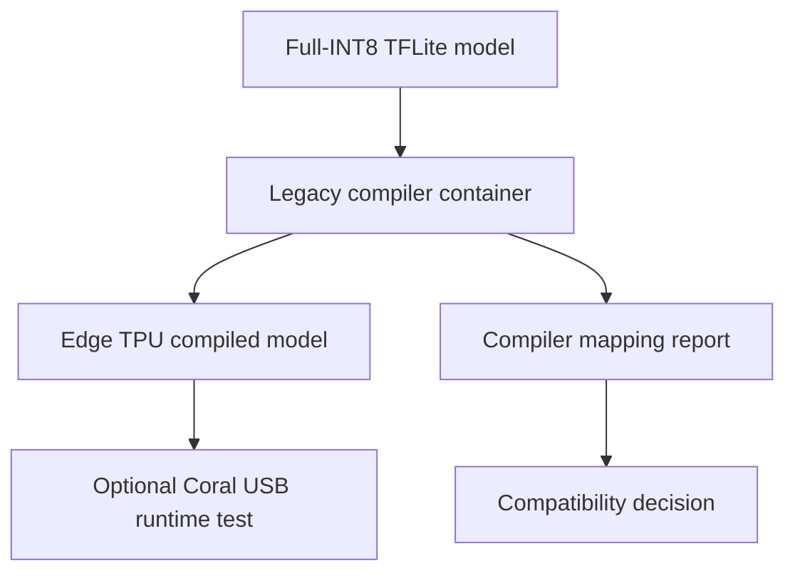

# Lab 05 — Coral Edge TPU Compiler Workflow

> **Chapter:** [03 — MLOps for Containers and Edge Devices](../../README.md)
> **Status:** Complete for the compiler workflow
> **Hardware status:** Physical Coral USB execution is optional and
> hardware-dependent
> **Focus:** Full-INT8 model preparation, isolated legacy tooling, compilation
> evidence, compatibility boundaries, and hardware-aware validation.

[← Previous lab: CPU Edge Inference](../04-edge-inference-cpu/) ·
[Chapter overview](../../README.md) ·
[Repository home](../../../../README.md)

## Objective

Take the full-integer TensorFlow Lite model from Lab 04 and pass it through the
Coral Edge TPU compiler in an isolated container. The output is an Edge TPU
targeted TensorFlow Lite artifact plus the compiler report used to determine
whether operations were mapped successfully.

This lab deliberately separates two milestones:

1. **Compiler validation:** reproducible without owning the USB accelerator.
2. **Physical-device validation:** requires supported Coral hardware, USB
   access, architecture-compatible runtime packages, and a real inference run.

The first milestone is complete in this repository. The second is an optional
hardware-in-the-loop extension—not a hidden prerequisite for completing the
chapter's software workflow.

## Compatibility Notice

The Edge TPU compiler and parts of the PyCoral software stack are legacy,
platform-sensitive components. Current Fedora and current Python releases do
not provide a clean, first-party host installation path for every component.
The compiler is therefore isolated in a purpose-built image rather than
modifying the Fedora host with stale repositories or unsupported packages.

Containerization preserves the educational workflow, but it does not make an
unmaintained dependency current or secure. Treat the image as a constrained
build tool and record its origin, version, and scan results.

## Workflow



## Files and Generated Artifacts

| Path | Purpose | Git policy |
|---|---|---|
| `Dockerfile` | Isolates the Edge TPU compiler and its compatible base system | Track |
| `README.md` | Defines the compiler and hardware validation runbook | Track |
| `models/model-full-int8.tflite` | Input copied from Lab 04 | Generate/copy |
| `models/model-full-int8_edgetpu.tflite` | Edge TPU-targeted output | Generate |
| compiler console output | Operator mapping and compilation evidence | Capture in CI/build records |

## Prerequisite Artifact

Lab 05 depends on the fully integer-quantized output of Lab 04. Dynamic-range
quantization is not sufficient for the Edge TPU compiler contract.

From the Lab 05 directory, create the model directory and copy the exact input:

```bash
cd ~/practical-mlops-book/chapters/03-containers-and-edge-devices/labs/05-edge-tpu-compiler
mkdir -p models
cp \
  ../04-edge-inference-cpu/artifacts/model-full-int8.tflite \
  models/model-full-int8.tflite
```

Validate the handoff:

```bash
test -s models/model-full-int8.tflite \
  && sha256sum models/model-full-int8.tflite
```

The checksum links the compiler result to the exact input artifact. In a real
pipeline, this relationship belongs in model-registry metadata or signed build
provenance.

## Build the Compiler Image

```bash
podman build \
  --tag localhost/ch03-edgetpu-compiler:legacy \
  .
```

The `legacy` tag communicates support status; it is still mutable. For an
auditable release process, additionally record the resulting image digest:

```bash
podman image inspect \
  localhost/ch03-edgetpu-compiler:legacy \
  | jq --raw-output '.[0].Digest // .[0].Id'
```

## Confirm the Tool Contract

Before compiling the model, confirm that the image can execute the tool:

```bash
podman run \
  --rm \
  localhost/ch03-edgetpu-compiler:legacy \
  --help
```

Depending on the Dockerfile's `ENTRYPOINT`, arguments after the image name are
passed directly to `edgetpu_compiler`.

## Compile the Full-INT8 Model

```bash
podman run \
  --rm \
  --volume "$PWD/models:/models:Z" \
  localhost/ch03-edgetpu-compiler:legacy \
  --out_dir /models \
  /models/model-full-int8.tflite
```

Command anatomy:

| Element | Meaning |
|---|---|
| `--rm` | Removes the one-shot compiler container after it exits |
| `--volume` | Makes the host model directory available inside the image |
| `:Z` | Applies a private SELinux label for the bind mount |
| `--out_dir /models` | Writes the compiled artifact back to the mounted directory |
| final path | Selects the full-INT8 source artifact |

Expected generated file:

```text
models/model-full-int8_edgetpu.tflite
```

## Read the Compiler Report

Compiler success means more than exit code zero. Review the operator summary:

- how many operations were mapped to the Edge TPU;
- whether any operations remain on the CPU;
- whether unsupported operator messages appear;
- estimated on-chip memory use; and
- number of Edge TPU subgraphs.

A compiled file can still contain CPU fallbacks. That may be valid, but it can
reduce the latency improvement and requires both CPU and accelerator runtime
support on the target.

## Validate the Compiler Output

```bash
test -s models/model-full-int8_edgetpu.tflite \
  && echo "Lab 05 compiler artifact validation passed"
```

Record both identities:

```bash
sha256sum \
  models/model-full-int8.tflite \
  models/model-full-int8_edgetpu.tflite
```

Compare file sizes without treating size alone as a quality measure:

```bash
ls -lh \
  models/model-full-int8.tflite \
  models/model-full-int8_edgetpu.tflite
```

## Optional Physical Coral USB Validation

Install Fedora's USB inspection utility:

```bash
sudo dnf install -y usbutils
```

Attach the device and inspect the USB bus:

```bash
lsusb
```

Depending on whether the device is before or after runtime initialization, a
Coral USB Accelerator commonly appears with a Google or Global Unichip vendor
identity. Do not validate only a memorized USB ID; compare the bus before and
after attachment and use the vendor's hardware documentation for the exact
model.

Physical inference additionally requires:

- compatible `libedgetpu` runtime libraries;
- compatible TensorFlow Lite or PyCoral bindings;
- access to the USB device from the chosen runtime/container;
- input preprocessing identical to model calibration; and
- comparison against the CPU reference output.

Because those packages have strict operating-system, Python, architecture, and
hardware constraints, this repository does not claim that a current Fedora host
can install the historical stack cleanly. A supported Debian-family target,
Raspberry Pi image, dedicated edge host, or pinned device-runtime container may
be the practical hardware test environment.

## Hardware-in-the-Loop CI Pattern

Do not attach production USB devices to general public CI runners. A controlled
pipeline can use a labeled self-hosted runner:

```text
source and model checks
    → build compiler image
    → compile artifact
    → publish immutable candidate
    → self-hosted Coral runner
    → latency and output-tolerance checks
    → approve or reject promotion
```

The runner should be isolated, patched, inventory-managed, and able to recover
from a failed test without leaving the device in an unknown state.

## Common Failures

| Symptom | Likely cause | Recovery |
|---|---|---|
| `Model is not quantized` | Float or dynamic-range model supplied | Use the full-INT8 artifact from Lab 04 |
| Unsupported operation | Model contains an operator the Edge TPU cannot map | Change architecture, select supported ops, or accept measured CPU fallback |
| Output file missing | Mount/output path is wrong or compilation failed | Inspect exit status and keep input/output under `/models` |
| Permission denied on `models/` | Rootless ownership or SELinux label mismatch | Keep `:Z` and inspect host ownership/mode |
| Package repository or key error during build | Legacy upstream repository changed or expired | Pin an approved archived source; do not disable verification silently |
| `lsusb` shows no device | Cable, port, power, passthrough, or hardware issue | Compare bus state, try a known data cable/port, and inspect kernel logs |
| Runtime cannot open the accelerator | USB permissions or container device mapping | Use explicit least-privilege device access and documented udev policy |
| Compiled model runs mostly on CPU | Too many unsupported/fallback operations | Use the compiler report to redesign or select another target |

## Security and Lifecycle Policy

- Keep the legacy tool out of the Fedora host package set.
- Pin the base image and package versions as tightly as the tool permits.
- Scan the image, document accepted findings, and restrict network access.
- Use the compiler only for trusted model inputs.
- Do not store credentials in the Dockerfile, build arguments, or layers.
- Retain compiler logs, image identity, input hash, and output hash.
- Define a retirement or replacement plan if the target hardware/toolchain is
  no longer supportable.

## Production Alternatives

If the legacy Edge TPU toolchain does not meet security or support requirements,
evaluate the target workload against maintained alternatives such as CPU/ARM
TensorFlow Lite, ONNX Runtime, vendor NPUs, NVIDIA Jetson/TensorRT, OpenVINO, or
a managed edge platform. Selection should be based on measured latency,
throughput, power, accuracy, fleet operations, lifecycle, and total cost—not on
accelerator branding alone.

## DevOps, MLOps, and LLMOps Connection

This compiler behaves like a hardware-specific build stage. DevOps contributes
isolated toolchains, provenance, release gates, and hardware runners. MLOps adds
prediction-tolerance checks and model lineage. LLMOps applies the same reasoning
to GPU architecture, CUDA/ROCm versions, quantized weight formats, optimized
kernels, and serving engines: an artifact that runs on one target is not
automatically portable to another.

## Completion Evidence

- [x] Full-INT8 prerequisite artifact copied and hashed
- [x] Legacy compiler isolated in a container image
- [x] Compiler help/version path exercised
- [x] Edge TPU-targeted artifact generated
- [x] Compiler operator report reviewed
- [x] Input and output identities recorded
- [x] Hardware boundary documented explicitly
- [ ] Optional inference on a physical Coral USB Accelerator

The unchecked hardware item does not make the compiler lab incomplete; it marks
an optional capability that cannot be truthfully claimed without the physical
device and runtime evidence.

[← Previous lab: CPU Edge Inference](../04-edge-inference-cpu/) ·
[Chapter overview](../../README.md) ·
[Repository home](../../../../README.md)
